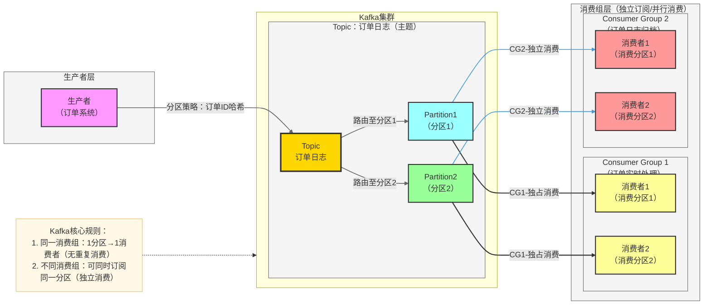

```mermaid
flowchart LR
    %% 样式定义（沿用历史配色，保持视觉一致性）
    classDef producerStyle fill:#f9f,stroke:#333,stroke-width:2px
    classDef topicStyle fill:#ffd700,stroke:#333,stroke-width:3px
    classDef partitionStyle1 fill:#9ff,stroke:#333,stroke-width:2px
    classDef partitionStyle2 fill:#9f9,stroke:#333,stroke-width:2px
    classDef consumerGroup1Style fill:#ff9,stroke:#333,stroke-width:2px
    classDef consumerGroup2Style fill:#f99,stroke:#333,stroke-width:2px
    classDef subgraphStyle fill:#f5f5f5,stroke:#666,stroke-width:1px,rounded:10px
    classDef kafkaClusterStyle fill:#e8f4f8,stroke:#4299e1,stroke-width:1.5px,rounded:10px
    classDef ruleNoteStyle fill:#fff8e6,stroke:#ffb74d,stroke-width:1px,rounded:8px

    %% 1. 生产者层
    subgraph producerLayer["生产者层"]
        A[生产者<br/>（订单系统）]:::producerStyle
    end
    class producerLayer subgraphStyle

    %% 2. Kafka集群层（核心：Topic+分区，补充规则说明）
    subgraph kafkaCluster["Kafka集群"]
        subgraph topicLayer["Topic：订单日志（主题）"]
            B[Topic<br/>订单日志]:::topicStyle
            C[Partition1<br/>（分区1）]:::partitionStyle1
            D[Partition2<br/>（分区2）]:::partitionStyle2
        end
        class topicLayer subgraphStyle

    end
    class kafkaCluster kafkaClusterStyle

    %% 3. 消费组层（明确组内/跨组逻辑）
    subgraph consumerLayer["消费组层（独立订阅/并行消费）"]
        %% 消费组1：订单实时处理
        subgraph group1["Consumer Group 1<br/>（订单实时处理）"]
            E[消费者1<br/>（消费分区1）]:::consumerGroup1Style
            F[消费者2<br/>（消费分区2）]:::consumerGroup1Style
        end
        class group1 subgraphStyle

        %% 消费组2：订单日志归档
        subgraph group2["Consumer Group 2<br/>（订单日志归档）"]
            G[消费者1<br/>（消费分区1）]:::consumerGroup2Style
            H[消费者2<br/>（消费分区2）]:::consumerGroup2Style
        end
        class group2 subgraphStyle
    end
    class consumerLayer subgraphStyle

    %% 核心流转逻辑（优化标签表述，更贴合Kafka术语）
    A -->|分区策略：订单ID哈希| B
    B -->|路由至分区1| C
    B -->|路由至分区2| D

    %% 同一消费组内：分区→消费者（唯一分配，无重复消费）
    C -->|CG1-独占消费| E
    D -->|CG1-独占消费| F

    %% 不同消费组间：分区→消费者（跨组独立消费，互不干扰）
    C -->|CG2-独立消费| G
    D -->|CG2-独立消费| H

    %% 连接线统一样式（区分组内/跨组：组内黑色加粗，跨组蓝色）
    linkStyle 0,1,2 stroke:#666,stroke-width:1.5px,arrowheadStyle:filled
    linkStyle 3,4 stroke:#333,stroke-width:2px,arrowheadStyle:filled
    linkStyle 5,6 stroke:#4299e1,stroke-width:1.5px,arrowheadStyle:filled

    %% Kafka核心规则说明（避免歧义）
    Note[Kafka核心规则：<br/>1. 同一消费组：1分区→1消费者（无重复消费）<br/>2. 不同消费组：可同时订阅同一分区（独立消费）]:::ruleNoteStyle
    %% 注释关联
    Note -.-> kafkaCluster
```