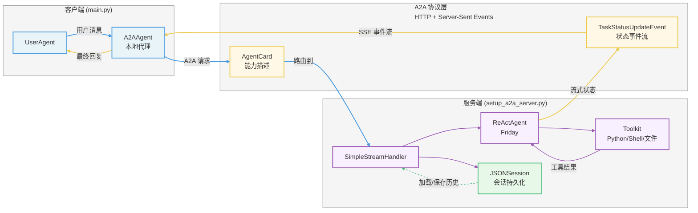
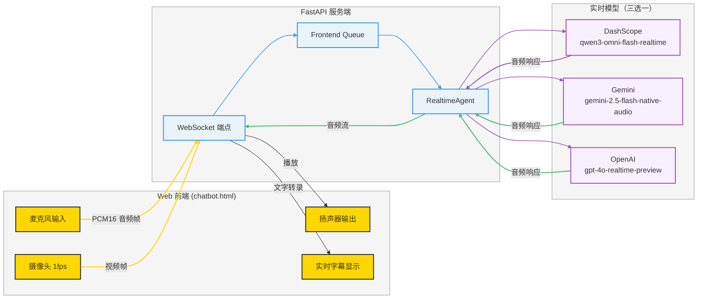
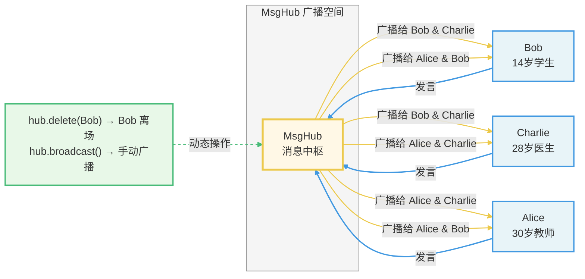
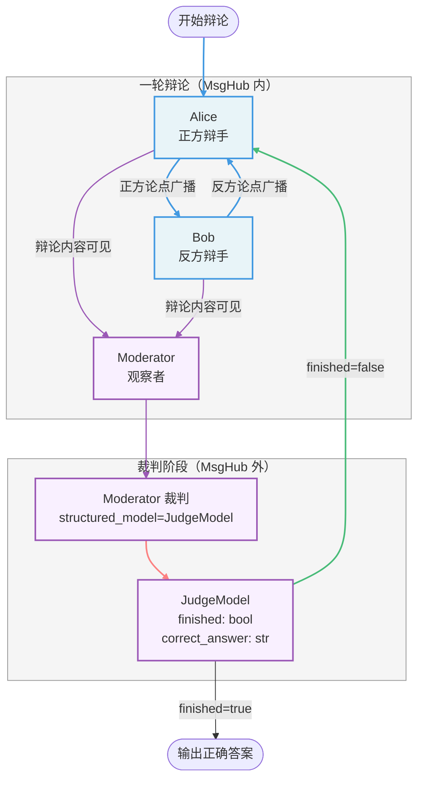
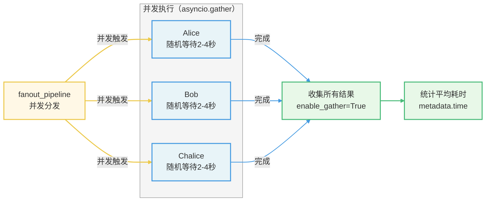
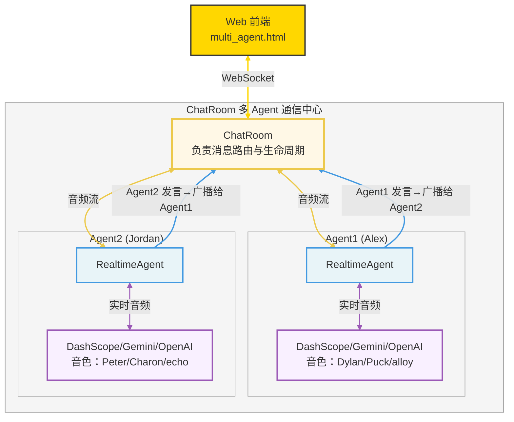
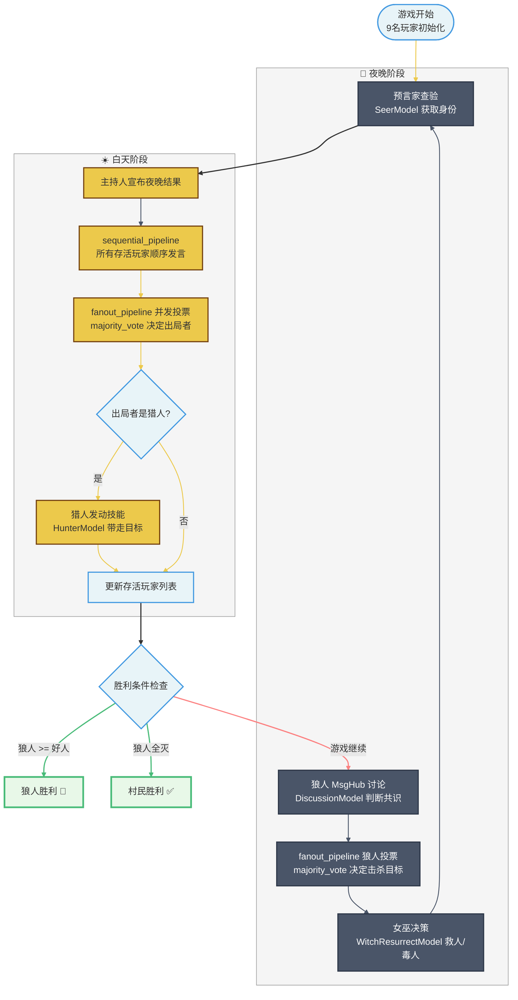
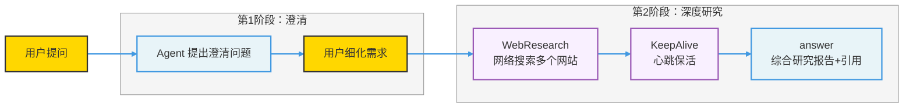
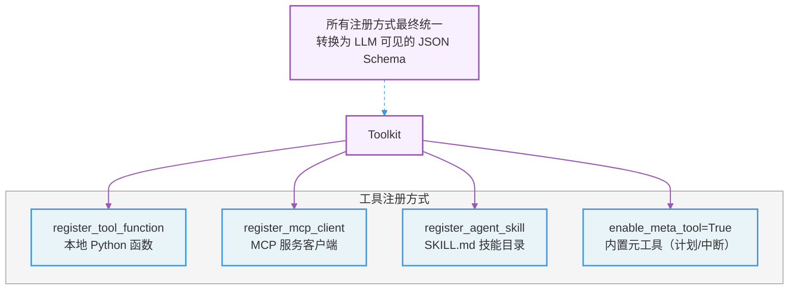

# AgentScope Examples 深度解析文档

> **版本**：AgentScope 1.0.16 | **日期**：2026-03-16  
> 本文档全面讲解 AgentScope 框架 `examples/` 目录下所有示例代码的架构、实现原理与最佳实践，适合开发者深度理解与实践。

---

## 目录

1. [总体架构概览](#1-总体架构概览)
2. [Agent 类示例详解](#2-agent-类示例详解)
   - 2.1 [ReAct Agent — 标准工具调用 Agent](#21-react-agent--标准工具调用-agent)
   - 2.2 [A2A Agent — 跨服务 Agent 协议](#22-a2a-agent--跨服务-agent-协议)
   - 2.3 [Voice Agent — 语音多模态 Agent](#23-voice-agent--语音多模态-agent)
   - 2.4 [Realtime Voice Agent — 实时语音 Agent](#24-realtime-voice-agent--实时语音-agent)
   - 2.5 [Meta Planner Agent — 元规划 Agent](#25-meta-planner-agent--元规划-agent)
3. [Workflows 工作流示例详解](#3-workflows-工作流示例详解)
   - 3.1 [MultiAgent Conversation — 多 Agent 广播对话](#31-multiagent-conversation--多-agent-广播对话)
   - 3.2 [MultiAgent Debate — 多 Agent 辩论](#32-multiagent-debate--多-agent-辩论)
   - 3.3 [MultiAgent Concurrent — 多 Agent 并发](#33-multiagent-concurrent--多-agent-并发)
   - 3.4 [MultiAgent Realtime — 多 Agent 实时语音](#34-multiagent-realtime--多-agent-实时语音)
4. [Functionality 功能示例详解](#4-functionality-功能示例详解)
   - 4.1 [RAG — 检索增强生成](#41-rag--检索增强生成)
   - 4.2 [MCP — 模型上下文协议](#42-mcp--模型上下文协议)
   - 4.3 [Plan — 计划管理](#43-plan--计划管理)
   - 4.4 [Structured Output — 结构化输出](#44-structured-output--结构化输出)
   - 4.5 [Agent Skill — Agent 技能系统](#45-agent-skill--agent-技能系统)
   - 4.6 [Long-Term Memory — 长期记忆](#46-long-term-memory--长期记忆)
   - 4.7 [Short-Term Memory Compression — 短期记忆压缩](#47-short-term-memory-compression--短期记忆压缩)
   - 4.8 [Session with SQLite — 会话持久化](#48-session-with-sqlite--会话持久化)
   - 4.9 [Stream Printing Messages — 流式消息打印](#49-stream-printing-messages--流式消息打印)
   - 4.10 [TTS — 语音合成](#410-tts--语音合成)
   - 4.11 [Vector Store — 向量数据库](#411-vector-store--向量数据库)
5. [Game 游戏示例详解 — 狼人杀](#5-game-游戏示例详解--狼人杀)
6. [Deployment 部署示例详解](#6-deployment-部署示例详解)
7. [Integration 集成示例详解](#7-integration-集成示例详解)
8. [Tuner 调优示例详解](#8-tuner-调优示例详解)
9. [Evaluation 评测示例详解](#9-evaluation-评测示例详解)
10. [核心概念横向对比](#10-核心概念横向对比)
11. [FAQ — 面试常见问题](#11-faq--面试常见问题)

---

## 1. 总体架构概览

### 1.1 Examples 目录结构

AgentScope 的 `examples/` 目录按照功能场景分为 8 大类：

```
examples/
├── agent/                    # 单 Agent 场景
│   ├── a2a_agent/            # A2A 协议跨服务 Agent
│   ├── a2ui_agent/           # Agent-to-UI 协议
│   ├── react_agent/          # 标准 ReAct Agent
│   ├── voice_agent/          # 语音多模态 Agent
│   ├── realtime_voice_agent/ # 实时语音 Agent
│   └── meta_planner_agent/   # 元规划 Agent
├── workflows/                # 多 Agent 工作流
│   ├── multiagent_conversation/  # 广播对话
│   ├── multiagent_debate/        # 多智能体辩论
│   ├── multiagent_concurrent/    # 并发执行
│   └── multiagent_realtime/      # 实时多 Agent 语音
├── functionality/            # 核心功能示例
│   ├── rag/                  # 检索增强生成
│   ├── mcp/                  # 模型上下文协议
│   ├── plan/                 # 计划管理
│   ├── structured_output/    # 结构化输出
│   ├── agent_skill/          # Agent 技能
│   ├── long_term_memory/     # 长期记忆
│   ├── short_term_memory/    # 短期记忆压缩
│   ├── session_with_sqlite/  # SQLite 会话持久化
│   ├── stream_printing_messages/ # 流式消息
│   ├── tts/                  # 语音合成
│   └── vector_store/         # 向量数据库
├── game/
│   └── werewolves/           # 狼人杀多 Agent 游戏
├── deployment/
│   └── planning_agent/       # 生产级部署示例
├── integration/
│   ├── alibabacloud_api_mcp/ # 阿里云 API MCP
│   └── qwen_deep_research_model/ # Qwen 深度研究模型
├── tuner/
│   └── react_agent/          # 强化学习调优
└── evaluation/
    └── ace_bench/            # ACE 工具调用基准评测
```

### 1.2 整体架构概览图

```mermaid
flowchart TD
    %% 样式定义
    classDef coreStyle fill:#f9f0ff,stroke:#9b59b6,stroke-width:2px
    classDef agentStyle fill:#e8f4f8,stroke:#4299e1,stroke-width:2px
    classDef workflowStyle fill:#e8f8e8,stroke:#48bb78,stroke-width:2px
    classDef funcStyle fill:#fff8e6,stroke:#ecc94b,stroke-width:2px
    classDef gameStyle fill:#fff0f0,stroke:#fc8181,stroke-width:2px
    classDef deployStyle fill:#f0fff4,stroke:#38a169,stroke-width:2px
    classDef subgraphStyle fill:#f5f5f5,stroke:#999,stroke-width:1px

    subgraph core["AgentScope 框架核心"]
        AS[AgentScope Core]:::coreStyle
        subgraph baseClasses["基础类"]
            AB[AgentBase]:::coreStyle
            RA[ReActAgent]:::coreStyle
            UA[UserAgent]:::coreStyle
        end
        subgraph infra["基础设施"]
            MH[MsgHub]:::coreStyle
            TK[Toolkit]:::coreStyle
            MEM[Memory]:::coreStyle
        end
    end
    class core subgraphStyle
    class baseClasses subgraphStyle
    class infra subgraphStyle

    subgraph agents["Agent 场景示例"]
        A1[ReAct Agent<br/>工具调用]:::agentStyle
        A2[A2A Agent<br/>跨服务协议]:::agentStyle
        A3[Voice Agent<br/>语音多模态]:::agentStyle
        A4[Realtime Voice<br/>实时语音]:::agentStyle
        A5[Meta Planner<br/>元规划分解]:::agentStyle
    end
    class agents subgraphStyle

    subgraph workflows["工作流示例"]
        W1[对话广播<br/>MsgHub]:::workflowStyle
        W2[多 Agent 辩论<br/>结构化裁判]:::workflowStyle
        W3[并发执行<br/>fanout_pipeline]:::workflowStyle
        W4[实时语音<br/>ChatRoom]:::workflowStyle
    end
    class workflows subgraphStyle

    subgraph functionality["功能示例"]
        F1[RAG 检索]:::funcStyle
        F2[MCP 协议]:::funcStyle
        F3[计划管理]:::funcStyle
        F4[结构化输出]:::funcStyle
        F5[Agent 技能]:::funcStyle
        F6[长短期记忆]:::funcStyle
        F7[向量存储]:::funcStyle
        F8[流式输出]:::funcStyle
    end
    class functionality subgraphStyle

    subgraph advanced["高级示例"]
        G[狼人杀游戏]:::gameStyle
        D[生产级部署]:::deployStyle
        I[第三方集成]:::deployStyle
        T[强化学习调优]:::deployStyle
        E[基准评测]:::deployStyle
    end
    class advanced subgraphStyle

    AS --> agents
    AS --> workflows
    AS --> functionality
    AS --> advanced
    RA --> A1 & A2 & A3 & A5
    MH --> W1 & W2 & W4
    TK --> A1 & F2 & F5
    MEM --> F6

    linkStyle 0,1,2,3 stroke:#9b59b6,stroke-width:2px
    linkStyle 4,5,6,7,8 stroke:#4299e1,stroke-width:1.5px
    linkStyle 9,10,11 stroke:#48bb78,stroke-width:1.5px
```



---

## 2. Agent 类示例详解

### 2.1 ReAct Agent — 标准工具调用 Agent

**路径**：`examples/agent/react_agent/`

#### 核心概念

ReAct（Reason + Act）是 AgentScope 最基础的 Agent 范式，通过"思考—行动—观察"循环完成复杂任务。

**核心实现代码（`main.py`）**：

```python
async def main() -> None:
    # 1. 构建工具集
    toolkit = Toolkit()
    toolkit.register_tool_function(execute_shell_command)  # Shell 命令执行
    toolkit.register_tool_function(execute_python_code)    # Python 代码执行
    toolkit.register_tool_function(view_text_file)         # 文本文件查看

    # 2. 创建 ReActAgent
    agent = ReActAgent(
        name="Friday",
        sys_prompt="You are a helpful assistant named Friday.",
        model=DashScopeChatModel(
            api_key=os.environ.get("DASHSCOPE_API_KEY"),
            model_name="qwen-max",
            enable_thinking=False,
            stream=True,           # 开启流式输出
        ),
        formatter=DashScopeChatFormatter(),
        toolkit=toolkit,
        memory=InMemoryMemory(),   # 内存记忆（对话历史）
    )

    # 3. 用户-Agent 对话循环
    user = UserAgent("User")
    msg = None
    while True:
        msg = await user(msg)
        if msg.get_text_content() == "exit":
            break
        msg = await agent(msg)      # Ctrl+C 可中断 Agent 回复
```

#### ReAct 执行流程图

```mermaid
flowchart LR
    classDef userStyle fill:#ffd700,stroke:#333,stroke-width:2px
    classDef agentStyle fill:#e8f4f8,stroke:#4299e1,stroke-width:2px
    classDef toolStyle fill:#f9f0ff,stroke:#9b59b6,stroke-width:2px
    classDef llmStyle fill:#fff8e6,stroke:#ecc94b,stroke-width:2px
    classDef subgraphStyle fill:#f5f5f5,stroke:#999,stroke-width:1px

    U[用户输入]:::userStyle

    subgraph reactLoop["ReAct 循环（Think → Act → Observe）"]
        Think[LLM 推理<br/>分析任务意图]:::llmStyle
        Act[选择并调用工具<br/>execute_shell / python / view_file]:::toolStyle
        Observe[观察工具结果<br/>写入上下文]:::agentStyle
        Done{任务完成?}:::agentStyle
    end
    class reactLoop subgraphStyle

    Output[输出最终答案]:::agentStyle

    U --> Think
    Think --> Act
    Act -->|工具返回结果| Observe
    Observe --> Done
    Done -->|否| Think
    Done -->|是| Output

    linkStyle 0 stroke:#4299e1,stroke-width:2px
    linkStyle 1,2,3,4 stroke:#48bb78,stroke-width:1.5px
    linkStyle 5 stroke:#fc8181,stroke-width:1.5px
    linkStyle 6 stroke:#9b59b6,stroke-width:2px
```

#### 关键特性

| 特性 | 说明 |
|------|------|
| 工具注册 | `toolkit.register_tool_function()` 注册任意 Python 函数 |
| 流式输出 | `stream=True` 开启逐 Token 输出，支持 `Ctrl+C` 中断 |
| 记忆管理 | `InMemoryMemory` 保存对话历史，多轮对话上下文感知 |
| Formatter | `DashScopeChatFormatter` 将消息格式化为 DashScope API 格式 |

---

### 2.2 A2A Agent — 跨服务 Agent 协议

**路径**：`examples/agent/a2a_agent/`

#### 核心概念

A2A（Agent-to-Agent）协议是 Google 提出的跨服务 Agent 互操作标准。AgentScope 支持将 Agent 封装为 A2A 服务，允许不同框架的 Agent 相互调用。

#### 架构组成

A2A 示例分为**服务端**和**客户端**两部分：

**服务端核心（`setup_a2a_server.py`）**：

```python
class SimpleStreamHandler:
    """处理 A2A 消息的流式处理器"""

    async def on_message_send_stream(self, params, context):
        # 1. 注册工具
        toolkit = Toolkit()
        toolkit.register_tool_function(execute_python_code)
        toolkit.register_tool_function(execute_shell_command)
        toolkit.register_tool_function(view_text_file)

        # 2. 创建 ReActAgent（服务端核心执行单元）
        agent = ReActAgent(
            name="Friday",
            model=DashScopeChatModel(model_name="qwen-max"),
            formatter=DashScopeChatFormatter(),
            toolkit=toolkit,
        )

        # 3. 加载会话历史（断点续聊）
        session = JSONSession(save_dir="./sessions")
        await session.load_session_state(session_id="test-a2a-agent", agent=agent)

        # 4. A2A 消息格式转换
        formatter = A2AChatFormatter()
        as_msg = await formatter.format_a2a_message(name="Friday", message=params.message)

        # 5. 流式输出任务状态事件
        yield TaskStatusUpdateEvent(state=TaskState.working)
        async for msg, last in stream_printing_messages(agents=[agent], ...):
            if last:
                yield TaskStatusUpdateEvent(message=a2a_message, state=TaskState.completed)

        # 6. 保存会话状态
        await session.save_session_state(session_id="test-a2a-agent", agent=agent)

# 注册 Agent 名片并启动服务器
app = A2AStarletteApplication(agent_card, handler).build()
# 启动: uvicorn setup_a2a_server:app --host 0.0.0.0 --port 8000
```

**客户端（`main.py`）**：

```python
async def main():
    user = UserAgent("user")

    # A2AAgent 作为远程 Agent 的本地代理
    agent = A2AAgent(agent_card=agent_card)  # agent_card 指定服务器地址

    msg = None
    while True:
        msg = await user(msg)
        if msg.get_text_content() == "exit":
            break
        msg = await agent(msg)   # 透明地调用远程 A2A 服务
```

#### A2A 通信流程图



#### Agent 名片定义（`agent_card.py`）

```python
agent_card = AgentCard(
    name="Friday",
    description="A simple ReAct agent that handles input queries",
    url="http://localhost:8000",         # 服务地址
    version="1.0.0",
    capabilities=AgentCapabilities(
        push_notifications=False,
        state_transition_history=True,   # 状态历史
        streaming=True,                   # 流式输出
    ),
    skills=[
        AgentSkill(name="execute_python_code", ...),
        AgentSkill(name="execute_shell_command", ...),
        AgentSkill(name="view_text_file", ...),
    ],
)
```

#### 当前限制

- 仅支持 chatbot 场景（不支持 push_notifications）
- 不支持实时中断（A2A 协议标准限制）
- 不支持结构化输出（实验性功能）

---

### 2.3 Voice Agent — 语音多模态 Agent

**路径**：`examples/agent/voice_agent/`

#### 核心概念

Voice Agent 基于 Qwen-Omni 多模态大模型，实现同时输出**文本 + 音频**的双模态响应。

**核心实现（`main.py`）**：

```python
async def main() -> None:
    agent = ReActAgent(
        name="Friday",
        sys_prompt="You are a helpful assistant",
        model=OpenAIChatModel(
            model_name="qwen3-omni-flash",
            client_kwargs={
                "base_url": "https://dashscope.aliyuncs.com/compatible-mode/v1",
            },
            api_key=os.getenv("DASHSCOPE_API_KEY"),
            stream=True,
            generate_kwargs={
                "modalities": ["text", "audio"],   # 同时输出文本和音频
                "audio": {
                    "voice": "Cherry",              # 音色选择
                    "format": "wav",                # 音频格式
                },
            },
        ),
        formatter=OpenAIChatFormatter(),
        memory=InMemoryMemory(),
    )
```

> **注意**：启用音频输出模式时，Qwen-Omni 可能不支持工具调用（实验性功能限制）。

---

### 2.4 Realtime Voice Agent — 实时语音 Agent

**路径**：`examples/agent/realtime_voice_agent/`

#### 核心概念

实时语音 Agent 基于 WebSocket 实现双向实时音频流，支持打断式对话（VAD），提供 Web 前端界面。

#### 服务架构（`run_server.py`）

```python
# FastAPI + WebSocket 实时语音服务
@app.websocket("/ws/{user_id}/{session_id}")
async def single_agent_endpoint(websocket, user_id, session_id):
    frontend_queue = asyncio.Queue()
    asyncio.create_task(frontend_receive(websocket, frontend_queue))

    while True:
        client_event = ClientEvents.from_json(await websocket.receive_json())

        if isinstance(client_event, ClientEvents.ClientSessionCreateEvent):
            # 根据 model_provider 选择模型
            model = {
                "dashscope": DashScopeRealtimeModel("qwen3-omni-flash-realtime"),
                "gemini":    GeminiRealtimeModel("gemini-2.5-flash-native-audio-preview"),
                "openai":    OpenAIRealtimeModel("gpt-4o-realtime-preview"),
            }[client_event.model_provider]

            agent = RealtimeAgent(name="Friday", sys_prompt=..., model=model, toolkit=toolkit)
            await agent.start(frontend_queue)

        elif client_event.type == ClientEventType.CLIENT_SESSION_END:
            await agent.stop()
        else:
            await agent.handle_input(client_event)
```

#### 实时语音数据流图



#### 支持的实时模型对比

| 提供商 | 模型名称 | 工具调用 | 视频输入 |
|--------|---------|---------|---------|
| DashScope | qwen3-omni-flash-realtime | 有限支持 | 支持 |
| Gemini | gemini-2.5-flash-native-audio-preview | 完整支持 | 支持 |
| OpenAI | gpt-4o-realtime-preview | 完整支持 | 不支持 |

---

### 2.5 Meta Planner Agent — 元规划 Agent

**路径**：`examples/agent/meta_planner_agent/`

#### 核心概念

Meta Planner Agent 实现了"**规划器—执行器**"（Planner-Worker）架构：
- **规划器**（Planner）：接收复杂任务，分解为子任务，动态创建 Worker Agent 执行
- **Worker Agent**：由 `create_worker` 工具函数动态实例化，拥有独立的 MCP 工具集

**规划器核心（`main.py`）**：

```python
async def main() -> None:
    toolkit = Toolkit()
    toolkit.register_tool_function(create_worker)  # 唯一工具：动态创建子 Agent

    planner = ReActAgent(
        name="Friday",
        sys_prompt="""You are Friday, a multifunctional agent...
        Your primary purpose is to break down complicated tasks into manageable subtasks,
        create worker agents to finish the subtask, and coordinate their execution.
        ### Important Constraints
        1. DO NOT TRY TO SOLVE THE SUBTASKS DIRECTLY yourself.
        2. Always follow the plan sequence.
        3. DO NOT finish the plan until all subtasks are finished.""",
        model=DashScopeChatModel(model_name="qwen3-max"),
        plan_notebook=PlanNotebook(),   # 任务计划管理器
        toolkit=toolkit,
        max_iters=20,
    )
```

**Worker 创建工具（`tool.py`）**：

```python
async def create_worker(task_description: str) -> AsyncGenerator[ToolResponse, None]:
    toolkit = Toolkit()

    # 按环境变量条件注册 MCP 工具
    if os.getenv("GAODE_API_KEY"):      # 高德地图（可选）
        client = HttpStatelessClient(url="https://mcp.amap.com/mcp?key=...")
        await toolkit.register_mcp_client(client, group_name="amap_tools")

    # Playwright 浏览器 MCP（默认启用）
    browser_client = StdIOStatefulClient(command="npx", args=["@playwright/mcp@latest"])
    await browser_client.connect()
    await toolkit.register_mcp_client(browser_client, group_name="browser_tools")

    # 创建 Worker Agent（动态实例化）
    sub_agent = ReActAgent(
        name="Worker",
        sys_prompt=f"Your target is to finish the given task: {task_description}",
        model=DashScopeChatModel(model_name="qwen3-max"),
        enable_meta_tool=True,    # 允许 Agent 自主管理工具
        toolkit=toolkit,
        max_iters=20,
    )
    sub_agent.set_console_output_enabled(False)  # 禁止 Worker 直接打印

    # 流式将 Worker 执行过程回传给规划器
    async for msg, _ in stream_printing_messages(agents=[sub_agent], coroutine_task=...):
        yield ToolResponse(content=..., stream=True, is_last=False)
        if msg.metadata.get("_is_interrupted"):
            raise asyncio.CancelledError()  # 中断信号传播

    # 返回结构化结果
    yield ToolResponse(content=[...], is_last=True)
```

#### 元规划架构流程图

```mermaid
flowchart TD
    classDef plannerStyle fill:#fff8e6,stroke:#ecc94b,stroke-width:2px
    classDef workerStyle fill:#e8f4f8,stroke:#4299e1,stroke-width:2px
    classDef toolStyle fill:#f9f0ff,stroke:#9b59b6,stroke-width:2px
    classDef mcpStyle fill:#e8f8e8,stroke:#48bb78,stroke-width:2px
    classDef subgraphStyle fill:#f5f5f5,stroke:#999,stroke-width:1px

    User[用户复杂任务]:::plannerStyle

    subgraph planner["规划层 (Meta Planner)"]
        PN[PlanNotebook<br/>任务计划管理]:::plannerStyle
        PA[Planner Agent<br/>Friday - qwen3-max]:::plannerStyle
        CW[create_worker 工具<br/>动态创建子 Agent]:::toolStyle
    end
    class planner subgraphStyle

    subgraph worker1["子任务1 (Worker Agent)"]
        W1[ReActAgent<br/>Worker]:::workerStyle
        subgraph mcp1["MCP 工具集"]
            AM[高德地图 MCP]:::mcpStyle
            BR[Playwright MCP<br/>浏览器自动化]:::mcpStyle
            GH[GitHub MCP]:::mcpStyle
            FT[文件读写工具]:::mcpStyle
        end
        class mcp1 subgraphStyle
    end
    class worker1 subgraphStyle

    subgraph worker2["子任务2 (Worker Agent)"]
        W2[ReActAgent<br/>Worker]:::workerStyle
    end
    class worker2 subgraphStyle

    Result[结构化结果<br/>success + message]:::plannerStyle

    User --> PA
    PA --> PN
    PN -->|分解任务| CW
    CW -->|实例化| W1
    CW -->|实例化| W2
    W1 --> mcp1
    W1 -->|流式回传执行过程| CW
    W2 -->|流式回传执行过程| CW
    CW -->|ToolResponse stream| PA
    PA -->|汇总所有结果| Result

    linkStyle 0 stroke:#ecc94b,stroke-width:2px
    linkStyle 1,2,3 stroke:#ecc94b,stroke-width:1.5px
    linkStyle 4,5 stroke:#4299e1,stroke-width:2px
    linkStyle 6,7 stroke:#48bb78,stroke-width:1.5px
    linkStyle 8,9,10 stroke:#9b59b6,stroke-width:2px
```

#### 三大核心能力

1. **任务分解规划**：通过 `PlanNotebook` 管理多步骤任务计划
2. **子 Agent 输出流式传递**：`create_worker` 是异步生成器，Worker 的执行过程实时流式回传给规划器
3. **中断事件传播**：Worker 被中断时，`_is_interrupted` 元数据字段向上传播，实现级联中断

---

## 3. Workflows 工作流示例详解

### 3.1 MultiAgent Conversation — 多 Agent 广播对话

**路径**：`examples/workflows/multiagent_conversation/`

#### 核心概念

`MsgHub` 是 AgentScope 的核心广播机制：在 `MsgHub` 上下文中，任何 Agent 的发言都会自动广播给所有其他参与者。

**核心实现（`main.py`）**：

```python
def create_participant_agent(name, age, career, character) -> ReActAgent:
    return ReActAgent(
        name=name,
        sys_prompt=f"You're a {age}-year-old {career} named {name}...",
        model=DashScopeChatModel(model_name="qwen-max", stream=True),
        formatter=DashScopeMultiAgentFormatter(),   # 多 Agent 专用 Formatter
    )

async def main():
    alice   = create_participant_agent("Alice", 30, "teacher", "friendly")
    bob     = create_participant_agent("Bob", 14, "student", "rebellious")
    charlie = create_participant_agent("Charlie", 28, "doctor", "thoughtful")

    async with MsgHub(
        participants=[alice, bob, charlie],
        announcement=Msg("system", "Now you meet each other with a brief self-introduction.", "system"),
    ) as hub:
        # 顺序触发三个 Agent 依次发言
        await sequential_pipeline([alice, bob, charlie])

        # 动态移除 Bob，广播其离开消息
        hub.delete(bob)
        await hub.broadcast(Msg("bob", "I have to start my homework now, see you later!", "assistant"))

        # Alice 和 Charlie 继续对话
        await alice()
        await charlie()
```

#### MsgHub 消息广播流程图



#### 关键 API

| API | 功能 |
|-----|------|
| `MsgHub(participants=[...])` | 创建广播空间，上下文管理器 |
| `hub.delete(agent)` | 动态移除参与者 |
| `hub.broadcast(msg)` | 手动广播消息 |
| `sequential_pipeline(agents)` | 顺序触发 Agent 列表 |
| `DashScopeMultiAgentFormatter` | 多 Agent 对话专用消息格式化器 |

---

### 3.2 MultiAgent Debate — 多 Agent 辩论

**路径**：`examples/workflows/multiagent_debate/`

#### 核心概念

实现了 EMNLP 2024 论文的辩论协议：多个辩手 Agent 交换观点，一个裁判 Agent 决定是否达成共识。

**核心实现（`main.py`）**：

```python
# 结构化裁判输出模型
class JudgeModel(BaseModel):
    finished: bool = Field(description="Whether the debate is finished")
    correct_answer: str | None = Field(default=None, description="The correct answer")

async def run_multiagent_debate():
    while True:
        # MsgHub 内：辩手发言互相可见
        async with MsgHub(participants=[alice, bob, moderator]):
            await alice(Msg("user", "You are affirmative side...", "user"))
            await bob(Msg("user", "You are negative side...", "user"))

        # MsgHub 外：裁判单独判决（辩手不接收裁判消息）
        msg_judge = await moderator(
            Msg("user", "Now have the debate finished...?", "user"),
            structured_model=JudgeModel,    # 强制结构化输出
        )

        if msg_judge.metadata.get("finished"):
            print("Correct answer:", msg_judge.metadata.get("correct_answer"))
            break
```

#### 辩论流程图



---

### 3.3 MultiAgent Concurrent — 多 Agent 并发

**路径**：`examples/workflows/multiagent_concurrent/`

#### 两种并发方式对比

```python
async def main():
    alice   = ExampleAgent("Alice")
    bob     = ExampleAgent("Bob")
    chalice = ExampleAgent("Chalice")

    # 方式一：asyncio.gather（Python 原生并发）
    await asyncio.gather(*[alice(), bob(), chalice()])

    # 方式二：fanout_pipeline（AgentScope 并发原语，自动收集结果）
    collected_res = await fanout_pipeline(
        agents=[alice, bob, chalice],
        enable_gather=True,    # 等待所有 Agent 完成并收集结果
    )

    # 统计各 Agent 耗时
    avg_time = np.mean([res.metadata["time"] for res in collected_res])
    print(f"Average time: {avg_time} seconds")
```

#### 并发执行时序图



| 并发方式 | 适用场景 | 结果收集 |
|---------|---------|---------|
| `asyncio.gather` | Python 原生，简单并发 | 手动处理 |
| `fanout_pipeline` | AgentScope 语义化，投票/并行问答 | 自动收集 |

---

### 3.4 MultiAgent Realtime — 多 Agent 实时语音

**路径**：`examples/workflows/multiagent_realtime/`

#### 核心概念

两个 `RealtimeAgent` 通过 `ChatRoom` 进行**全自主语音对话**，无需用户参与。

**核心实现（`run_server.py`）**：

```python
@app.websocket("/ws/{user_id}/{session_id}")
async def multi_agent_endpoint(websocket, user_id, session_id):
    client_event = ClientEvents.from_json(await websocket.receive_json())

    if isinstance(client_event, ClientEvents.ClientSessionCreateEvent):
        # 创建两个 RealtimeAgent（不同音色）
        agent1 = RealtimeAgent(name="Alex", sys_prompt="...", model=model1)
        agent2 = RealtimeAgent(name="Jordan", sys_prompt="...", model=model2)

        # ChatRoom 管理多 Agent 之间的通信
        chat_room = ChatRoom(agents=[agent1, agent2])
        await chat_room.start(frontend_queue)

        # 触发第一个 Agent 开始说话
        await agent1.model.send(TextBlock(text="<system>Now you can talk.</system>"))
```

#### 多 Agent 语音通信架构图



#### 与单 Agent 实时语音的对比

| 维度 | realtime_voice_agent | multiagent_realtime |
|------|---------------------|---------------------|
| Agent 数量 | 1个 | 2个（可扩展） |
| 管理组件 | 直接管理 `RealtimeAgent` | `ChatRoom` 统一管理 |
| 对话模式 | 用户 ↔ Agent | Agent ↔ Agent（全自主） |
| 启动触发 | 用户输入触发 | 系统消息触发自主开口 |
| 工具调用 | 支持（Gemini/OpenAI） | 不配置工具 |

---

## 4. Functionality 功能示例详解

### 4.1 RAG — 检索增强生成

**路径**：`examples/functionality/rag/`

AgentScope 提供四种 RAG 用法，从基础 API 到完整的 Agentic 集成。

#### 4.1.1 基础用法（`basic_usage.py`）

```python
async def main():
    # 1. 创建文档读取器
    text_reader = TextReader()
    pdf_reader  = PDFReader()

    # 2. 创建知识库（向量存储 + 嵌入模型）
    knowledge = SimpleKnowledge(
        vector_store=QdrantStore(location=":memory:"),  # 内存模式
        embedding_model=DashScopeTextEmbedding(
            api_key=os.environ.get("DASHSCOPE_API_KEY"),
        ),
    )

    # 3. 读取并写入文档
    docs = text_reader.read("example.txt") + pdf_reader.read("example.pdf")
    await knowledge.add_documents(docs)

    # 4. 语义检索
    results = await knowledge.retrieve(
        query="What is AgentScope?",
        limit=5,
        score_threshold=0.7,    # 相似度阈值过滤
    )
```

#### 4.1.2 Agentic 用法（`agentic_usage.py`）

```python
# 将知识库检索函数注册为工具，让 Agent 自主决定何时检索
toolkit.register_tool_function(knowledge.retrieve_knowledge)

agent = ReActAgent(
    name="Friday",
    model=DashScopeChatModel(...),
    toolkit=toolkit,
    memory=InMemoryMemory(),
)
# Agent 可动态调整：query、limit、score_threshold 参数
```

#### 4.1.3 ReActAgent 静态集成（`react_agent_integration.py`）

```python
# 直接传入 knowledge 对象，无需手动注册工具
agent = ReActAgent(
    name="Friday",
    model=DashScopeChatModel(...),
    knowledge=knowledge,         # Agent 每次 reply 时自动在开头检索
)
```

#### 4.1.4 多模态 RAG（`multimodal_rag.py`）

```python
# 图片文档读取 + 多模态嵌入
knowledge = SimpleKnowledge(
    vector_store=QdrantStore(location=":memory:"),
    embedding_model=DashScopeMultiModalEmbedding(...),  # 多模态嵌入
)
docs = ImageReader().read("example_image.png")
await knowledge.add_documents(docs)
```

#### RAG 四种用法对比图

```mermaid
flowchart LR
    classDef basicStyle fill:#ffd700,stroke:#333,stroke-width:2px
    classDef agenticStyle fill:#e8f4f8,stroke:#4299e1,stroke-width:2px
    classDef staticStyle fill:#f9f0ff,stroke:#9b59b6,stroke-width:2px
    classDef multimodalStyle fill:#e8f8e8,stroke:#48bb78,stroke-width:2px
    classDef subgraphStyle fill:#f5f5f5,stroke:#999,stroke-width:1px

    subgraph basic["基础用法 basic_usage"]
        B_DOC[TextReader/PDFReader<br/>读取文档]:::basicStyle
        B_KB[SimpleKnowledge<br/>QdrantStore + DashScope嵌入]:::basicStyle
        B_RET[knowledge.retrieve()<br/>直接调用检索 API]:::basicStyle
        B_DOC --> B_KB --> B_RET
    end
    class basic subgraphStyle

    subgraph agentic["Agentic 用法 agentic_usage"]
        A_TK[Toolkit<br/>注册 retrieve_knowledge 为工具]:::agenticStyle
        A_AGT[ReActAgent<br/>自主决定检索时机]:::agenticStyle
        A_TK --> A_AGT
    end
    class agentic subgraphStyle

    subgraph staticInt["静态集成 react_agent_integration"]
        S_AGT[ReActAgent<br/>knowledge= 参数直接传入]:::staticStyle
        S_AUTO[每次 reply 自动检索<br/>前置上下文注入]:::staticStyle
        S_AGT --> S_AUTO
    end
    class staticInt subgraphStyle

    subgraph multimodal["多模态 multimodal_rag"]
        M_IMG[ImageReader<br/>读取图片]:::multimodalStyle
        M_EMB[DashScopeMultiModalEmbedding<br/>图文联合嵌入]:::multimodalStyle
        M_VLM[qwen3-vl-plus<br/>视觉问答]:::multimodalStyle
        M_IMG --> M_EMB --> M_VLM
    end
    class multimodal subgraphStyle

    Note["灵活性：Agentic > 静态集成 > 基础<br/>多模态：ImageReader + 多模态嵌入"]

    linkStyle 0,1,2,3,4,5,6 stroke:#333,stroke-width:1.5px
```

---

### 4.2 MCP — 模型上下文协议

**路径**：`examples/functionality/mcp/`

#### 核心概念

MCP（Model Context Protocol）是 Anthropic 提出的标准化工具协议，AgentScope 支持 Agent 通过 MCP 调用外部服务。

#### 示例架构（三个文件协作）

**MCP 服务端（`mcp_add.py`、`mcp_multiply.py`）**：

```python
# 加法服务（端口 8001，SSE 传输）
mcp = FastMCP("Add", port=8001)

@mcp.tool()
def add(a: int, b: int) -> int:
    """Add two numbers."""
    return a + b

mcp.run(transport="sse")

# 乘法服务（端口 8002，StreamableHTTP 传输）
mcp = FastMCP("Multiply", port=8002)

@mcp.tool()
def multiply(c: int, d: int) -> int:
    """Multiply two numbers."""
    return c * d

mcp.run(transport="streamable-http")
```

**MCP 客户端（`main.py`）**：

```python
async def main():
    toolkit = Toolkit()

    # SSE 传输（有状态客户端，保持连接）
    add_client = HttpStatefulClient(
        name="add_mcp", transport="sse", url="http://127.0.0.1:8001/sse"
    )
    # StreamableHTTP 传输（无状态客户端，每次请求独立）
    multiply_client = HttpStatelessClient(
        name="multiply_mcp", transport="streamable_http", url="http://127.0.0.1:8002/mcp"
    )

    await toolkit.register_mcp_client(add_client)
    await toolkit.register_mcp_client(multiply_client)

    agent = ReActAgent(name="Friday", toolkit=toolkit, ...)
    msg = await agent(Msg("user", "What is 3+4 and 5*6?", "user"))
```

#### MCP 传输协议对比图

```mermaid
flowchart LR
    classDef agentStyle fill:#e8f4f8,stroke:#4299e1,stroke-width:2px
    classDef sseStyle fill:#ffd700,stroke:#333,stroke-width:2px
    classDef httpStyle fill:#f9f0ff,stroke:#9b59b6,stroke-width:2px
    classDef serverStyle fill:#e8f8e8,stroke:#48bb78,stroke-width:2px
    classDef subgraphStyle fill:#f5f5f5,stroke:#999,stroke-width:1px

    AGT[ReActAgent<br/>Friday]:::agentStyle

    subgraph sse["SSE 传输（有状态）"]
        SC[HttpStatefulClient<br/>保持长连接]:::sseStyle
        SS[MCP Add 服务器<br/>port: 8001]:::serverStyle
        SC <-->|Server-Sent Events| SS
    end
    class sse subgraphStyle

    subgraph http["StreamableHTTP 传输（无状态）"]
        HC[HttpStatelessClient<br/>每次请求独立]:::httpStyle
        HS[MCP Multiply 服务器<br/>port: 8002]:::serverStyle
        HC <-->|HTTP POST/Stream| HS
    end
    class http subgraphStyle

    AGT -->|调用 add 工具| SC
    AGT -->|调用 multiply 工具| HC

    linkStyle 0,1 stroke:#4299e1,stroke-width:2px
    linkStyle 2,3 stroke:#ecc94b,stroke-width:1.5px
    linkStyle 4,5 stroke:#9b59b6,stroke-width:1.5px
```

#### 两种 MCP 客户端对比

| 特性 | `HttpStatefulClient` | `HttpStatelessClient` |
|------|----------------------|----------------------|
| 传输协议 | SSE（Server-Sent Events） | StreamableHTTP |
| 连接状态 | 保持长连接 | 每次请求独立 |
| 适用场景 | 需要会话上下文的服务 | 无状态 API 调用 |
| 性能开销 | 低（复用连接） | 中（每次建连） |

---

### 4.3 Plan — 计划管理

**路径**：`examples/functionality/plan/`

#### 两种计划管理方式

**方式一：手动指定计划（`main_manual_plan.py`）**

```python
# 手动创建带子任务的计划
plan_notebook = PlanNotebook()
plan_notebook.create_plan(
    name="Research AgentScope",
    description="Clone and research AgentScope repository",
    expected_output="A comprehensive research report",
    subtasks=[
        SubTask(name="Clone Repository", description="Clone the AgentScope repository"),
        SubTask(name="Read Documentation", description="Read the docs/ directory"),
        SubTask(name="Study Code", description="Study the source code"),
        SubTask(name="Write Report", description="Write a comprehensive report"),
    ],
)

agent = ReActAgent(
    name="Friday",
    plan_notebook=plan_notebook,    # 注入预定义计划
    toolkit=toolkit,
    ...
)
```

**方式二：Agent 自主管理计划（`main_agent_managed_plan.py`）**

```python
agent = ReActAgent(
    name="Friday",
    enable_meta_tool=True,      # 允许 Agent 使用元工具（创建/更新计划）
    plan_notebook=PlanNotebook(),   # 空白计划本
    toolkit=toolkit,
    ...
)
# Agent 收到任务后，自主调用 meta_tool 创建和管理计划
```

#### 计划管理流程图

```mermaid
flowchart LR
    classDef manualStyle fill:#ffd700,stroke:#333,stroke-width:2px
    classDef agentStyle fill:#e8f4f8,stroke:#4299e1,stroke-width:2px
    classDef notebookStyle fill:#f9f0ff,stroke:#9b59b6,stroke-width:2px
    classDef subgraphStyle fill:#f5f5f5,stroke:#999,stroke-width:1px

    subgraph manual["手动计划模式"]
        M_DEV[开发者<br/>手动创建 PlanNotebook]:::manualStyle
        M_PLAN[SubTask 列表<br/>预定义步骤]:::manualStyle
        M_AGT[Agent<br/>按顺序执行]:::agentStyle
        M_DEV --> M_PLAN --> M_AGT
    end
    class manual subgraphStyle

    subgraph agentic["Agent 自主管理模式"]
        A_TASK[用户任务]:::agentStyle
        A_META[enable_meta_tool=True<br/>元工具激活]:::notebookStyle
        A_AGT[Agent<br/>自主创建/更新计划]:::agentStyle
        A_EXE[按计划执行子任务]:::agentStyle
        A_TASK --> A_META --> A_AGT --> A_EXE
    end
    class agentic subgraphStyle

    PN[PlanNotebook<br/>计划状态管理]:::notebookStyle
    PN -.->|状态持久| manual
    PN -.->|状态持久| agentic

    linkStyle 0,1,2,3,4,5 stroke:#4299e1,stroke-width:1.5px
    linkStyle 6,7 stroke:#9b59b6,stroke-width:1px,stroke-dasharray:4
```

---

### 4.4 Structured Output — 结构化输出

**路径**：`examples/functionality/structured_output/`

#### 核心概念

通过 `structured_model` 参数将 LLM 输出强制转换为 Pydantic 定义的结构，结果存入 `msg.metadata`。

```python
# 定义结构化输出模型
class TableModel(BaseModel):
    name:      str = Field(description="Full name of the person")
    age:       int = Field(ge=0, le=150, description="Age in years")
    intro:     str = Field(description="Brief introduction")
    honors:    List[str] = Field(description="List of honors")

class ChoiceModel(BaseModel):
    fruit: Literal["apple", "banana", "cherry"] = Field(description="Chosen fruit")

# 使用结构化输出
res = await agent(query_msg, structured_model=TableModel)
print(res.metadata["name"])    # 直接访问结构化字段
print(res.metadata["honors"])  # 列表字段

res2 = await agent(query_msg_2, structured_model=ChoiceModel)
print(res2.metadata["fruit"])  # "apple" | "banana" | "cherry"
```

#### 最佳实践

| 原则 | 说明 |
|------|------|
| 描述性字段名 | 使用清晰的 `Field(description=...)` |
| 约束验证 | 使用 `ge=`, `le=`, `Literal` 等约束 |
| 避免歧义 | 字段含义唯一，不依赖上下文 |
| 合理默认值 | 可选字段设置 `default=None` |

---

### 4.5 Agent Skill — Agent 技能系统

**路径**：`examples/functionality/agent_skill/`

#### 核心概念

Agent Skill 是一种**可复用的文档化能力**：通过 `SKILL.md` 定义技能的使用说明，注册后自动注入到 Agent 的系统提示中。

**技能定义（`SKILL.md`）**：

```markdown
---
name: analyzing-agentscope-library
description: A skill for analyzing the AgentScope library
---

# Analyzing AgentScope Library

When analyzing the AgentScope library:

## Strategy 1: Search Examples
Clone the repository and use `ls`/`cat` to browse `examples/` directory.

## Strategy 2: Search Tutorials
Browse `docs/tutorials/` directory.

## Strategy 3: Search Modules
Run: `python view_agentscope_module.py --module agentscope`
```

**技能注册（`main.py`）**：

```python
toolkit = Toolkit()
# 注册技能目录（自动读取 SKILL.md）
toolkit.register_agent_skill("./skill/analyzing-agentscope-library")

agent = ReActAgent(
    name="Friday",
    sys_prompt="All knowledge about AgentScope MUST come from the equipped skill.",
    toolkit=toolkit,
    ...
)
```

---

### 4.6 Long-Term Memory — 长期记忆

**路径**：`examples/functionality/long_term_memory/`

AgentScope 提供两种长期记忆实现：**Mem0** 和 **ReMe**。

#### Mem0 长期记忆（`mem0/memory_example.py`）

```python
long_term_memory = Mem0LongTermMemory(
    vector_store=QdrantStore(location=":memory:"),
    embedding_model=DashScopeTextEmbedding(...),
)

agent = ReActAgent(
    name="Friday",
    long_term_memory=long_term_memory,
    long_term_memory_mode="both",    # "record" | "retrieve" | "both"
    ...
)
```

#### ReMe 个人记忆（`reme/personal_memory_example.py`）

```python
async with ReMePersonalLongTermMemory(...) as long_term_memory:
    # 5 种核心接口
    # 1. 工具函数形式：写入
    await long_term_memory.record_to_memory(thinking="...", content="...")
    # 2. 工具函数形式：检索
    results = await long_term_memory.retrieve_from_memory(keywords=["Alice", "preference"])
    # 3. 直接方法：写入消息列表
    await long_term_memory.record(msgs=[user_msg, agent_msg])
    # 4. 直接方法：检索
    results = await long_term_memory.retrieve(msg=query_msg)
    # 5. Agent 集成
    agent = ReActAgent(..., long_term_memory=long_term_memory)
```

#### ReMe 任务记忆（`reme/task_memory_example.py`）

```python
async with ReMeTaskLongTermMemory(...) as task_memory:
    # 记录任务执行轨迹（带评分，用于强化学习）
    await task_memory.record_to_memory(
        thinking="...",
        content="Task trajectory...",
        score=0.8,   # 轨迹质量评分（0-1）
    )
```

#### 长期记忆架构图

```mermaid
flowchart LR
    classDef agentStyle fill:#e8f4f8,stroke:#4299e1,stroke-width:2px
    classDef memStyle fill:#fff8e6,stroke:#ecc94b,stroke-width:2px
    classDef storeStyle fill:#f9f0ff,stroke:#9b59b6,stroke-width:2px
    classDef subgraphStyle fill:#f5f5f5,stroke:#999,stroke-width:1px

    AGT[ReActAgent]:::agentStyle

    subgraph mem0["Mem0 实现"]
        M0[Mem0LongTermMemory]:::memStyle
        M0_VS[QdrantStore<br/>向量存储]:::storeStyle
        M0_EMB[DashScopeTextEmbedding<br/>嵌入模型]:::storeStyle
        M0 --> M0_VS
        M0 --> M0_EMB
    end
    class mem0 subgraphStyle

    subgraph reme["ReMe 实现"]
        RP[ReMePersonalLongTermMemory<br/>个人偏好记忆]:::memStyle
        RT[ReMeTaskLongTermMemory<br/>任务经验记忆（含评分）]:::memStyle
    end
    class reme subgraphStyle

    AGT -->|long_term_memory_mode:<br/>record / retrieve / both| M0
    AGT -->|自动记录对话/个人信息| RP
    AGT -->|积累任务执行经验| RT

    linkStyle 0,1,2 stroke:#4299e1,stroke-width:1.5px
    linkStyle 3,4 stroke:#ecc94b,stroke-width:1px
    linkStyle 5,6 stroke:#9b59b6,stroke-width:1px
```

---

### 4.7 Short-Term Memory Compression — 短期记忆压缩

**路径**：`examples/functionality/short_term_memory/memory_compression/`

#### 核心实现

```python
# 配置记忆压缩策略
from agentscope.memory import InMemoryMemory, CompressionConfig, CharTokenCounter

agent = ReActAgent(
    name="Friday",
    memory=InMemoryMemory(
        compression_config=CompressionConfig(
            enable=True,
            trigger_threshold=1000,   # Token 超过 1000 时触发压缩
            keep_recent=3,            # 保留最近 3 条消息（原文）
            token_counter=CharTokenCounter(),   # 按字符计数
        ),
    ),
    ...
)
```

**压缩逻辑**：当对话历史超过 `trigger_threshold` 时，自动调用 LLM 对旧消息进行摘要压缩，保留最近 `keep_recent` 条消息不压缩。

---

### 4.8 Session with SQLite — 会话持久化

**路径**：`examples/functionality/session_with_sqlite/`

#### 核心概念

通过自定义 `SqliteSession`（继承 `SessionBase`）实现多用户 Agent 状态隔离存储。

**SQLite 会话实现（`sqlite_session.py`）**：

```python
class SqliteSession(SessionBase):
    """SQLite 持久化会话"""

    def __init__(self, db_path: str = "session.db"):
        # 创建表：session_id, session_data(JSON), created_at, updated_at
        self._init_db()

    async def save_session_state(self, session_id: str, **agents) -> None:
        state = {}
        for name, agent in agents.items():
            # 序列化 Agent 所有 StateModule（包括 Memory）
            state[name] = {
                module_name: module.state_dict()
                for module_name, module in agent.state_modules.items()
            }
        # 写入数据库（JSON 序列化）
        self._upsert(session_id, json.dumps(state))

    async def load_session_state(self, session_id: str, allow_not_exist=True, **agents) -> None:
        row = self._query(session_id)
        if row is None:
            return  # 首次会话，不报错
        state = json.loads(row["session_data"])
        for name, agent in agents.items():
            for module_name, module_state in state[name].items():
                agent.state_modules[module_name].load_state_dict(module_state)
```

**主程序多用户隔离（`main.py`）**：

```python
session = SqliteSession(db_path="./sessions/my_session.db")
friday = ReActAgent(name="Friday", ...)

# Alice 的会话
await session.load_session_state("alice", friday_of_user=friday)
msg = await friday(alice_msg)
await session.save_session_state("alice", friday_of_user=friday)

# Bob 的会话（独立记忆空间）
await session.load_session_state("bob", friday_of_user=friday)
msg = await friday(bob_msg)
await session.save_session_state("bob", friday_of_user=friday)
```

#### 会话状态机图

```mermaid
flowchart TD
    classDef userStyle fill:#ffd700,stroke:#333,stroke-width:2px
    classDef sessionStyle fill:#e8f4f8,stroke:#4299e1,stroke-width:2px
    classDef agentStyle fill:#f9f0ff,stroke:#9b59b6,stroke-width:2px
    classDef dbStyle fill:#e8f8e8,stroke:#48bb78,stroke-width:2px
    classDef subgraphStyle fill:#f5f5f5,stroke:#999,stroke-width:1px

    UA[用户 A (Alice)]:::userStyle
    UB[用户 B (Bob)]:::userStyle

    subgraph session["会话管理层"]
        SL[load_session_state<br/>加载用户状态]:::sessionStyle
        SS[save_session_state<br/>保存用户状态]:::sessionStyle
    end
    class session subgraphStyle

    AGT[Friday Agent<br/>共享实例]:::agentStyle

    subgraph db["SQLite 数据库"]
        DA[session_id='alice'<br/>memory + state]:::dbStyle
        DB[session_id='bob'<br/>memory + state]:::dbStyle
    end
    class db subgraphStyle

    UA -->|发起请求| SL
    SL -->|加载 Alice 状态| DA
    DA -->|反序列化| AGT
    AGT -->|生成响应| SS
    SS -->|序列化| DA

    UB -->|发起请求| SL
    SL -->|加载 Bob 状态| DB
    DB -->|反序列化| AGT
    AGT -->|生成响应| SS
    SS -->|序列化| DB

    linkStyle 0,1,2,3,4 stroke:#4299e1,stroke-width:1.5px
    linkStyle 5,6,7,8,9 stroke:#ecc94b,stroke-width:1.5px
```

---

### 4.9 Stream Printing Messages — 流式消息打印

**路径**：`examples/functionality/stream_printing_messages/`

#### 核心概念

`stream_printing_messages` 提供了一种**外部收集 Agent 打印消息**的机制，适用于需要自定义展示层（如 Web 界面）的场景。

**单 Agent 流式输出（`single_agent.py`）**：

```python
# 关闭 Agent 的默认控制台输出
agent.set_console_output_enabled(False)

# 通过 stream_printing_messages 外部收集打印消息
async for msg, last in stream_printing_messages(
    agents=[agent],
    coroutine_task=agent(user_msg),  # 传入协程任务
):
    print(f"[{'LAST' if last else 'STREAM'}] {msg.content}")
    if last:
        final_response = msg
```

**多 Agent 流式输出（`multi_agent.py`）**：

```python
async def workflow():
    async with MsgHub(participants=[alice, bob, charlie]) as hub:
        await sequential_pipeline([alice, bob, charlie])

# 同时收集三个 Agent 的打印消息
async for msg, last in stream_printing_messages(
    agents=[alice, bob, charlie],
    coroutine_task=workflow(),
):
    print(f"[{msg.name}] {msg.content}")
```

---

### 4.10 TTS — 语音合成

**路径**：`examples/functionality/tts/`

```python
agent = ReActAgent(
    name="Friday",
    tts_model=DashScopeRealtimeTTSModel(
        api_key=os.environ.get("DASHSCOPE_API_KEY"),
        model_name="qwen3-tts-flash-realtime",   # 实时流式 TTS
        voice="Cherry",                            # 音色选择
    ),
    ...
)
# Agent 回复后自动触发 TTS，流式合成并播放
```

---

### 4.11 Vector Store — 向量数据库

**路径**：`examples/functionality/vector_store/`

AgentScope 支持多种向量存储后端，统一 API 接口。

#### 四种操作场景

| 场景 | 说明 |
|------|------|
| 基础 CRUD | add / search / delete，MilvusLite 支持本地文件持久化 |
| 过滤搜索 | 元数据过滤，MilvusLite: `filter='doc_id like "prog%"'`，MongoDB: `{"doc_id": {"$in": [...]}}` |
| 多 Chunk 文档 | 同一文档分多块存储，保留 `chunk_id/total_chunks` 字段 |
| 距离度量 | COSINE / L2（欧氏距离）/ IP（内积）三种 |

#### 支持的向量存储后端

| 后端 | 类名 | 特点 |
|------|------|------|
| Milvus Lite | `MilvusLiteStore` | 本地文件持久化，无需服务器 |
| MongoDB Atlas | `MongoDBStore` | 云端托管，MongoDB 查询语法 |
| OceanBase | `OceanBaseStore` | 阿里云分布式数据库 |
| 阿里云 MySQL | `AlibabaCloudMySQLStore` | 云端 MySQL 向量扩展 |

---

## 5. Game 游戏示例详解 — 狼人杀

**路径**：`examples/game/werewolves/`

#### 核心概念

狼人杀是 AgentScope 最复杂的多 Agent 示例，展示了：
- **多 Agent 角色扮演**：9 个 Player Agent 分别扮演不同角色
- **消息可见性控制**：不同阶段不同参与者可见不同消息
- **结构化决策**：所有关键决策使用 Pydantic 结构化输出
- **会话持久化**：支持断点续玩

#### 游戏角色分配

| 角色 | 数量 | 阵营 | 特殊能力 |
|------|------|------|---------|
| Werewolf（狼人） | 3 | 狼人阵营 | 夜晚击杀目标 |
| Villager（村民） | 3 | 好人阵营 | 白天投票 |
| Witch（女巫） | 1 | 好人阵营 | 一次解药 + 一次毒药 |
| Seer（预言家） | 1 | 好人阵营 | 每晚查验身份 |
| Hunter（猎人） | 1 | 好人阵营 | 死亡时带走一人 |

#### 完整游戏流程（`game.py`）

```python
async def run_game(players, roles, ...):
    while True:
        # === 夜晚阶段 ===
        # 1. 狼人用 MsgHub 讨论（仅狼人可见）
        async with MsgHub(participants=wolves, enable_auto_broadcast=False) as hub:
            await hub.broadcast(Msg("host", "Wolves, discuss your target"))
            async for msg, _ in stream_printing_messages(...):
                ...
            # 判断狼人是否达成共识（DiscussionModel）
            consensus_msg = await wolf_leader(
                consensus_query, structured_model=DiscussionModel
            )

        # 2. fanout_pipeline 并发收集狼人投票
        wolf_votes = await fanout_pipeline(agents=wolves, enable_gather=True)
        kill_target = majority_vote([v.metadata["target"] for v in wolf_votes])

        # 3. 女巫决策（救人/毒人）
        witch_msg = await witch(
            Msg("host", f"Player {kill_target} was killed. Use potion?"),
            structured_model=WitchResurrectModel,
        )

        # 4. 预言家查验
        seer_msg = await seer(
            Msg("host", "Choose a player to verify"),
            structured_model=SeerModel,
        )

        # === 白天阶段 ===
        # 1. 所有存活玩家顺序发言
        async with MsgHub(participants=alive_players) as hub:
            await hub.broadcast(Msg("host", "Morning announcement..."))
            await sequential_pipeline(alive_players)

        # 2. 并发投票
        day_votes = await fanout_pipeline(agents=alive_players, enable_gather=True)
        vote_out = majority_vote([v.metadata["target"] for v in day_votes])

        # 3. 检查猎人
        if roles[vote_out] == "Hunter":
            hunter_target = await hunter(hunter_query, structured_model=HunterModel)

        # 4. 检查胜利条件
        if count_wolves(alive_players) >= count_villagers(alive_players):
            return "Wolves win!"
        if count_wolves(alive_players) == 0:
            return "Villagers win!"
```

#### 狼人杀完整游戏流程图



#### 关键技术亮点

| 技术 | 应用场景 | 实现方式 |
|------|---------|---------|
| `MsgHub` | 控制消息可见范围 | 狼人讨论仅狼人可见 |
| `enable_auto_broadcast=False` | 禁止自动广播 | 配合手动 `broadcast()` |
| `fanout_pipeline` | 并发投票 | 同时让所有玩家投票 |
| `majority_vote` | 投票统计 | 自动统计多数票 |
| 结构化输出 | 角色决策 | 避免自由文本解析的不稳定 |
| `JSONSession` | 断点续玩 | 保存/加载全部玩家状态 |

---

## 6. Deployment 部署示例详解

**路径**：`examples/deployment/planning_agent/`

#### 核心概念

演示如何将 AgentScope Agent 部署为**生产级 HTTP 服务**，支持：
- 多用户并发会话隔离
- SSE（Server-Sent Events）流式响应
- Planner-Worker 双层架构
- 通过 `JSONSession` 持久化用户状态

**服务端（`main.py`）**：

```python
app = Quart(__name__)   # 异步 HTTP 框架

@app.post("/chat_endpoint")
async def chat_endpoint():
    data = await request.get_json()
    user_id    = data["user_id"]
    session_id = data["session_id"]
    user_input = data["user_input"]

    # 创建 Planner Agent
    friday = ReActAgent(
        name="Friday",
        toolkit=Toolkit([create_worker]),  # Worker 创建工具
        ...
    )

    # 加载用户历史会话
    session = JSONSession(save_dir="./sessions/")
    await session.load_session_state(session_id=session_id, friday=friday)

    # 构建用户消息
    msg = Msg(user_id, user_input, "user")

    # SSE 流式响应
    async def generate():
        async for chunk, last in stream_printing_messages(
            agents=[friday], coroutine_task=friday(msg)
        ):
            yield f"data: {chunk.content}\n\n"
            if last:
                # 保存会话状态
                await session.save_session_state(session_id=session_id, friday=friday)
                yield "data: [DONE]\n\n"

    return Response(generate(), content_type="text/event-stream")
```

#### 部署架构图

```mermaid
flowchart LR
    classDef clientStyle fill:#ffd700,stroke:#333,stroke-width:2px
    classDef serverStyle fill:#e8f4f8,stroke:#4299e1,stroke-width:2px
    classDef plannerStyle fill:#fff8e6,stroke:#ecc94b,stroke-width:2px
    classDef workerStyle fill:#f9f0ff,stroke:#9b59b6,stroke-width:2px
    classDef sessionStyle fill:#e8f8e8,stroke:#48bb78,stroke-width:2px
    classDef subgraphStyle fill:#f5f5f5,stroke:#999,stroke-width:1px

    subgraph clients["客户端"]
        C1[用户 Alice<br/>POST /chat_endpoint]:::clientStyle
        C2[用户 Bob<br/>POST /chat_endpoint]:::clientStyle
    end
    class clients subgraphStyle

    subgraph server["Quart HTTP 服务器"]
        EP[/chat_endpoint<br/>SSE 流式响应]:::serverStyle

        subgraph planner["Planner 层"]
            PA[Friday Agent<br/>Planner]:::plannerStyle
            CW[create_worker<br/>动态创建工具]:::plannerStyle
        end
        class planner subgraphStyle

        subgraph workers["Worker 层（动态）"]
            W1[Worker1<br/>AMap/Browser/GitHub]:::workerStyle
            W2[Worker2<br/>File Tools]:::workerStyle
        end
        class workers subgraphStyle
    end
    class server subgraphStyle

    subgraph storage["会话存储"]
        JS[JSONSession<br/>./sessions/]:::sessionStyle
        SA[Alice 会话状态]:::sessionStyle
        SB[Bob 会话状态]:::sessionStyle
    end
    class storage subgraphStyle

    C1 -->|POST| EP
    C2 -->|POST| EP
    EP --> PA
    PA -->|create_worker| W1 & W2
    W1 & W2 -->|流式结果| PA
    PA -->|SSE 流| EP
    EP -->|text/event-stream| C1 & C2
    JS -.->|加载/保存| SA & SB
    EP <-.->|会话隔离| JS

    linkStyle 0,1 stroke:#ffd700,stroke-width:2px
    linkStyle 2,3,4,5,6,7 stroke:#4299e1,stroke-width:1.5px
    linkStyle 8,9,10 stroke:#48bb78,stroke-width:1px,stroke-dasharray:4
```

---

## 7. Integration 集成示例详解

### 7.1 Qwen Deep Research Model

**路径**：`examples/integration/qwen_deep_research_model/`

#### 核心概念

集成阿里云 `qwen-deep-research` 专用深度研究模型，实现两阶段研究流程。

**深度研究 Agent（`qwen_deep_research_agent.py`）**：

```python
class QwenDeepResearchAgent(AgentBase):
    """集成 Qwen Deep Research 专用模型的 Agent"""

    async def reply(self, msg: Msg) -> Msg:
        self._memory.add(msg)

        # 统计用户消息数，判断当前阶段
        user_msg_count = sum(1 for m in self._memory if m.role == "user")

        if user_msg_count == 1:
            # 第一阶段：提出澄清问题
            response = await self._call_model(clarification=True)
        else:
            # 第二阶段：深度研究
            response = await self._call_model(deep_research=True)

        return self._process_responses(response)

    def _process_responses(self, response):
        """处理流式多阶段响应"""
        for chunk in response:
            phase = chunk.metadata.get("phase")
            if phase == "WebResearch":
                # 显示研究进度（搜索目标、网站列表）
                print(f"🔍 Researching: {chunk.content}")
            elif phase == "KeepAlive":
                # 心跳保活（不显示）
                pass
            elif phase == "answer":
                # 最终答案（自动附加 References 引用列表）
                print(f"📝 Answer: {chunk.content}")
```

**两阶段研究流程图**：



---

## 8. Tuner 调优示例详解

**路径**：`examples/tuner/react_agent/`

#### 核心概念

使用 AgentScope 的 `tune()` API 对 ReAct Agent 进行**强化学习（GRPO）调优**，以数学推理任务（GSM8K）为例。

```python
# 1. 工作流函数：Agent 解题
async def run_react_agent(task: str, model: ModelBase) -> WorkflowOutput:
    agent = ReActAgent(
        name="MathSolver",
        sys_prompt="Solve math problems. Format answer as \\boxed{answer}.",
        model=model,
        toolkit=Toolkit([execute_python_code]),   # 允许使用 Python 计算
    )
    msg = await agent(Msg("user", task, "user"))
    return WorkflowOutput(response=msg.content)

# 2. 评判函数：验证答案正确性
def gsm8k_judge(task: str, response: WorkflowOutput) -> JudgeOutput:
    reward = MathBoxedRewardFn.compute(
        ground_truth=task.metadata["answer"],
        response=response.response,
    )
    return JudgeOutput(reward=reward)

# 3. 训练配置
tune(
    workflow=run_react_agent,
    judge=gsm8k_judge,
    dataset=load_dataset("openai/gsm8k", "main", split="train"),
    model_name="Qwen/Qwen3-0.6B",
    algorithm="multi_step_grpo",
    group_size=8,
    batch_size=32,
    num_inference_engines=4,    # 并行推理引擎数
    learning_rate=1e-6,
)
```

#### 强化学习调优流程图

```mermaid
flowchart LR
    classDef dataStyle fill:#ffd700,stroke:#333,stroke-width:2px
    classDef agentStyle fill:#e8f4f8,stroke:#4299e1,stroke-width:2px
    classDef judgeStyle fill:#f9f0ff,stroke:#9b59b6,stroke-width:2px
    classDef trainStyle fill:#e8f8e8,stroke:#48bb78,stroke-width:2px
    classDef subgraphStyle fill:#f5f5f5,stroke:#999,stroke-width:1px

    DS[GSM8K 数据集]:::dataStyle

    subgraph inference["推理阶段（×4 并行引擎）"]
        RA[ReActAgent<br/>解答数学题]:::agentStyle
        PY[execute_python_code<br/>辅助计算]:::agentStyle
        RA --> PY --> RA
    end
    class inference subgraphStyle

    subgraph judge["评判阶段"]
        JF[gsm8k_judge<br/>MathBoxedRewardFn]:::judgeStyle
        RW[奖励信号<br/>reward ∈ [0, 1]]:::judgeStyle
        JF --> RW
    end
    class judge subgraphStyle

    subgraph train["训练阶段（GRPO）"]
        GRP[multi_step_grpo<br/>group_size=8, batch_size=32]:::trainStyle
        LR[lr=1e-6<br/>模型参数更新]:::trainStyle
        GRP --> LR
    end
    class train subgraphStyle

    DS -->|任务采样| RA
    RA -->|response| JF
    RW -->|梯度信号| GRP
    LR -->|更新模型| RA

    linkStyle 0,1 stroke:#4299e1,stroke-width:2px
    linkStyle 2,3 stroke:#9b59b6,stroke-width:1.5px
    linkStyle 4,5 stroke:#48bb78,stroke-width:2px
```

---

## 9. Evaluation 评测示例详解

**路径**：`examples/evaluation/ace_bench/`

#### 核心概念

使用 `ACEBenchmark` 评测框架，测试 ReAct Agent 的**工具调用能力**（Android 手机模拟器任务）。

```python
async def react_agent_solution(ace_task: ACETask, pre_hook) -> ACEResult:
    toolkit = Toolkit()

    # 从任务元数据动态加载工具（JSON Schema 定义）
    for tool_name, json_schema in ace_task.metadata["tools"].items():
        tool_func = load_tool_function(tool_name)
        toolkit.register_tool_function(tool_func, json_schema=json_schema)

    # 注册预钩子（日志记录）
    toolkit.register_pre_hook("pre_print", pre_hook)

    agent = ReActAgent(name="ACE_Solver", toolkit=toolkit, ...)
    await agent(Msg("user", ace_task.instruction, "user"))

    # 收集工具调用轨迹
    trajectory = [
        block for msg in agent.memory
        for block in msg.content
        if block.type in ["tool_use", "tool_result"]
    ]

    # 获取手机模拟器最终状态
    final_state = ACEPhone.get_current_state()

    return ACEResult(trajectory=trajectory, final_state=final_state)

# 并行评测（Ray 多 Worker）
evaluator = RayEvaluator(
    solution=react_agent_solution,
    storage=FileEvaluatorStorage("./results/"),
    num_workers=8,
)
results = await evaluator.run(benchmark=ACEBenchmark())
```

---

## 10. 核心概念横向对比

### 10.1 Agent 类型对比

| Agent 类型 | 基类 | 工具支持 | 记忆 | 适用场景 |
|-----------|------|---------|------|---------|
| `ReActAgent` | `AgentBase` | `Toolkit` | `InMemoryMemory` | 通用工具调用 |
| `A2AAgent` | `AgentBase` | 透明代理 | 远程服务端 | 跨服务调用 |
| `RealtimeAgent` | `AgentBase` | 支持（Gemini/OpenAI） | 模型内置 | 实时语音对话 |
| `UserAgent` | `AgentBase` | 无 | 无 | 代理用户输入 |
| 自定义 Agent | `AgentBase` | 自定义 | 自定义 | 领域特定 |

### 10.2 多 Agent 编排模式对比

| 编排模式 | 组件 | 特点 | 典型场景 |
|---------|------|------|---------|
| 顺序执行 | `sequential_pipeline` | 串行，前一个输出是后一个输入 | 流水线处理 |
| 并发执行 | `fanout_pipeline` | 并行，收集所有结果 | 投票/并行问答 |
| 广播空间 | `MsgHub` | 消息自动广播给所有参与者 | 多方对话 |
| 实时通信 | `ChatRoom` | 多 Agent 实时音频互联 | 语音 Agent 对话 |
| 动态创建 | `create_worker` 工具 | 按需实例化子 Agent | 元规划 |

### 10.3 记忆系统对比

| 记忆类型 | 类名 | 持久化 | 语义搜索 | 典型用途 |
|---------|------|--------|---------|---------|
| 短期记忆 | `InMemoryMemory` | 内存（重启丢失） | 无 | 单次会话上下文 |
| 短期记忆（压缩） | `InMemoryMemory` + `CompressionConfig` | 内存 | 无 | 长对话 Token 控制 |
| 长期记忆（Mem0） | `Mem0LongTermMemory` | Qdrant 向量库 | 有 | 用户个性化记忆 |
| 长期记忆（ReMe-个人） | `ReMePersonalLongTermMemory` | 持久化 | 有 | 用户偏好管理 |
| 长期记忆（ReMe-任务） | `ReMeTaskLongTermMemory` | 持久化 | 有 | 任务经验积累 |
| 会话持久化 | `SQLiteSession` / `JSONSession` | SQLite/JSON | 无 | 多用户会话恢复 |

### 10.4 工具注册方式对比



---

## 11. FAQ — 面试常见问题

### 基础概念类

---

**Q1：AgentScope 的 ReActAgent 和普通调用 LLM API 有什么区别？**

**A**：ReActAgent 实现了 ReAct（Reason + Act）范式，核心区别在于：
1. **工具调用循环**：ReActAgent 在单次 `reply()` 内可以多轮调用工具（Think → Act → Observe），直到任务完成，而直接调用 LLM API 只有一次请求-响应
2. **工具集成**：通过 `Toolkit` 统一管理工具，自动将工具函数转换为 LLM 可识别的 JSON Schema
3. **记忆管理**：内置 `Memory` 组件自动维护对话历史，多轮对话上下文感知
4. **中断支持**：支持 `Ctrl+C` 实时中断正在进行的工具调用链
5. **异步优先**：全程 `async/await`，天然支持并发

---

**Q2：MsgHub 的广播机制是如何工作的？什么时候需要使用它？**

**A**：`MsgHub` 是 AgentScope 的共享消息空间，工作原理如下：
- 进入 `MsgHub` 上下文时，所有参与 Agent 的 `memory` 被统一管理
- 任何一个 Agent 调用 `reply()` 产生的消息，自动添加到所有其他 Agent 的上下文中
- 离开 `MsgHub` 上下文时，消息共享空间关闭

**适用场景**：
- 多人讨论（所有人都需要看到所有发言）
- 辩论（辩手互相看到彼此观点）
- 有限观察者（裁判在 MsgHub 内观察，在 MsgHub 外单独判决）

**不适用场景**：
- 信息需要隔离时（如狼人杀夜晚阶段，用 `enable_auto_broadcast=False`）
- 需要精细控制消息传递时

---

**Q3：A2A 协议和普通的 HTTP API 调用有什么本质区别？**

**A**：
| 维度 | A2A 协议 | 普通 HTTP API |
|------|---------|-------------|
| 语义 | Agent 对 Agent 的能力调用 | 客户端对服务器的数据请求 |
| 发现机制 | AgentCard 描述能力和接口 | OpenAPI/Swagger |
| 交互模式 | 任务状态机（working/completed/failed） | 请求-响应 |
| 流式支持 | 原生 SSE 事件流 | 需要额外实现 |
| 互操作性 | 跨框架（任何实现 A2A 的 Agent） | 框架绑定 |
| 会话管理 | 原生任务 ID 跟踪 | 自定义实现 |

---

**Q4：`fanout_pipeline` 和 `asyncio.gather` 在 AgentScope 中的区别是什么？**

**A**：
- `asyncio.gather`：Python 标准库，仅提供并发执行，返回结果顺序与输入一致
- `fanout_pipeline`：AgentScope 语义化封装，额外提供：
  - `enable_gather=True` 自动等待所有 Agent 完成并收集结果
  - 与 MsgHub 集成（结果消息自动处理广播逻辑）
  - 语义更清晰，表达"将同一任务分发给多个 Agent"的意图

**实际建议**：在 AgentScope 工作流中优先使用 `fanout_pipeline`，仅在需要原生异步控制时使用 `asyncio.gather`。

---

### 架构设计类

---

**Q5：Meta Planner Agent 中为什么 Worker 不直接打印输出，而是通过异步生成器回传？**

**A**：这是一个关键的架构设计决策：
1. **可控性**：Worker 的输出由 Planner 统一管理，Planner 可以选择是否展示、如何展示
2. **中断传播**：Worker 被 `Ctrl+C` 中断时，`_is_interrupted` 元数据通过 `ToolResponse` 传递给 Planner，实现级联中断
3. **流式体验**：用户看到的是 Planner 汇总后的实时进度，而不是多个 Worker 交织输出
4. **测试友好**：Worker 可以静默运行（`set_console_output_enabled(False)`），便于单元测试

---

**Q6：ReMe 长期记忆中的任务记忆和个人记忆有什么本质区别？**

**A**：
| 维度 | 个人记忆（Personal） | 任务记忆（Task） |
|------|---------------------|----------------|
| 存储内容 | 用户偏好、个人信息、交互习惯 | 任务执行轨迹、解题步骤、工具调用序列 |
| 检索方式 | 基于关键词/语义 | 基于任务相似性 |
| 评分机制 | 无 | `score` 参数（0-1，用于 RL） |
| 主要用途 | 个性化服务 | 避免重复错误，复用成功经验 |
| 数据特征 | 结构化个人数据 | 半结构化执行轨迹 |

---

**Q7：狼人杀示例中，为什么所有关键决策都使用 Pydantic 结构化输出而不是让 Agent 自由回答？**

**A**：这是工程实践中的重要经验：
1. **稳定性**：自由文本输出需要正则/字符串匹配，高度不稳定（如 "Player 3"、"player3"、"No.3" 都可能出现）
2. **类型安全**：`DiscussionModel(finished: bool, target: int)` 通过 Pydantic 验证，错误格式直接报错重试
3. **逻辑清晰**：代码中直接 `msg.metadata["finished"]`，语义明确
4. **可测试性**：结构化输出可以直接断言，自由文本很难测试
5. **多模型兼容**：不同 LLM 的输出风格差异很大，结构化约束统一了接口

---

**Q8：SQLite 会话持久化和 JSONSession 如何实现多用户状态隔离？**

**A**：两者都实现了 `SessionBase` 接口，状态隔离机制如下：

1. **序列化层**：调用 Agent 所有 `StateModule`（Memory、ToolCallState 等）的 `state_dict()` 方法，转换为 JSON
2. **存储层**：以 `session_id`（通常是用户 ID）为 Key 存储 JSON 数据（SQLite 表行 / JSON 文件）
3. **恢复层**：加载时通过 `session_id` 读取对应数据，调用 `load_state_dict()` 还原 Agent 状态

关键点：**同一个 Agent 实例可以服务多个用户**（每次请求前 load，响应后 save），避免了为每用户创建独立进程的开销。

---

### 性能与工程实践类

---

**Q9：AgentScope 中流式输出（streaming）是如何工作的？对用户体验有什么影响？**

**A**：AgentScope 的流式输出分两层：
1. **模型层**：`model=DashScopeChatModel(stream=True)` 开启 LLM Token 级流式输出（SSE）
2. **Agent 层**：`stream_printing_messages()` 收集 Agent 打印消息，实现外部程序的流式消费

**用户体验提升**：
- 首字符延迟（TTFT）从等待完整响应（几秒）降低到几十毫秒
- 长任务（如 Meta Planner 调用多个 Worker）可实时看到进度
- 支持 `Ctrl+C` 中断，用户体验更流畅

---

**Q10：ReAct Agent 的 `max_iters` 参数如何影响性能和成本？应该如何设置？**

**A**：`max_iters` 限制 ReAct 循环的最大迭代次数（一次迭代 = 一次 Think + 一次或多次 Act）。

**影响**：
- 设置太低：复杂任务可能未完成就被截断
- 设置太高：简单任务也可能陷入无效循环，浪费 API 调用

**建议策略**：
- 简单工具调用任务：`max_iters=5~10`
- 复杂规划任务（如 Meta Planner）：`max_iters=20~30`
- 游戏/评测：根据任务复杂度测试后确定
- 始终配合 `PlanNotebook` 使用，计划本身提供了完成的判断依据

---

**Q11：MCP 的 Stateful 和 Stateless 客户端分别适合哪些场景？**

**A**：
- **`HttpStatefulClient`（有状态，SSE 传输）**：
  - 适合需要维护会话上下文的服务（如数据库连接、认证状态）
  - 性能更好（复用 TCP 连接）
  - 需要服务器支持 SSE 流

- **`HttpStatelessClient`（无状态，StreamableHTTP 传输）**：
  - 适合无状态 API 服务（如计算、查询）
  - 更简单，易于水平扩展
  - 适合云函数/Serverless 环境

**实际建议**：优先使用 `HttpStatelessClient`，除非工具服务明确需要状态（如打开文件句柄、数据库事务）。

---

**Q12：如何在 AgentScope 中实现 Agent 的水平扩展以处理高并发？**

**A**：AgentScope 提供多层扩展机制：

1. **无状态 Agent**：Agent 实例本身无状态（状态外置到 SQLiteSession/JSONSession），可水平扩展多个进程实例
2. **`RayEvaluator`**：ACE Bench 使用 Ray 并行评测，同理可用于生产级并发 Agent 任务
3. **MCP 服务扩展**：MCP 工具服务独立部署，可独立扩展
4. **异步 I/O**：全异步架构，单进程可处理大量并发对话（`asyncio` 事件循环）
5. **`num_inference_engines`**：Tuner 中的并行推理引擎，可应用于批量推理场景

**推荐架构（生产环境）**：
```
负载均衡器 → N 个 Quart/FastAPI 服务实例（无状态 Agent）
                    ↓
            SQLite/Redis Session 共享存储
                    ↓
            MCP 工具服务集群（独立扩展）
```

---

**Q13：狼人杀中 `enable_auto_broadcast=False` 是什么意思？为什么需要它？**

**A**：`MsgHub` 默认情况下（`enable_auto_broadcast=True`）会将每个 Agent 的发言自动广播给所有其他参与者。

在狼人杀夜晚阶段，**不能让村民看到狼人的讨论**，因此：
```python
async with MsgHub(participants=wolves, enable_auto_broadcast=False) as hub:
    # 狼人在私密空间讨论
    await hub.broadcast(Msg("host", "Wolves, discuss in secret", "system"))
    await wolf1(...)
    await wolf2(...)
    # 只有手动调用 hub.broadcast() 的消息才会发出
    await hub.broadcast(Msg("host", "Wolves have chosen...", "system"))  # 公开宣布
```

这实现了**信息不对称**，这正是狼人杀游戏的核心机制。

---

**Q14：AgentScope 的强化学习调优（GRPO）和传统 SFT 微调有什么区别？**

**A**：
| 维度 | GRPO 强化学习 | 传统 SFT 微调 |
|------|-------------|-------------|
| 训练数据 | 任务 + 评判函数（奖励信号） | 高质量 (输入, 输出) 对 |
| 标注成本 | 低（只需定义评判函数） | 高（需要人工标注正确答案） |
| 探索性 | 高（Agent 自主探索解题路径） | 低（仅学习已有样本） |
| 适用场景 | 有客观评判标准的任务（数学/代码） | 风格对齐、格式化输出 |
| 训练效率 | 低（需要大量探索） | 高 |

AgentScope 的 `multi_step_grpo` 特别针对**多步骤工具调用轨迹**设计，支持对工具调用过程中的中间步骤给予奖励，而不仅仅是最终答案。

---

**Q15：实时语音 Agent 中，`ChatRoom` 和 `MsgHub` 有什么区别？**

**A**：两者都是多 Agent 消息协调组件，但针对不同场景：

| 维度 | `MsgHub` | `ChatRoom` |
|------|---------|------------|
| 通信媒介 | 文本消息 | 实时音频流 |
| 参与者 | 文本 Agent | `RealtimeAgent` |
| 消息格式 | `Msg` 对象 | PCM16 音频帧 |
| 并发模型 | 轮流发言 | 全双工实时（VAD 检测） |
| 典型用途 | 文本多 Agent 对话 | 语音 Agent 自主对话 |
| 扩展性 | 支持动态增删 `hub.delete()` | `ChatRoom(agents=[...])` |

简言之：`MsgHub` 是文本世界的"会议室"，`ChatRoom` 是语音世界的"实时通话频道"。

---

*文档结束。如需更多示例细节，请参考 `examples/` 目录下各子目录的 `README.md` 文件。*
