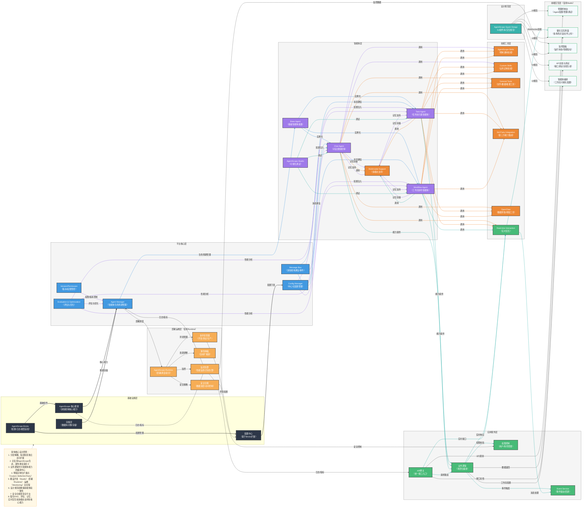

# 基于 AgentScope 生态的智能体平台项目设计

## 一、项目架构 Mermaid 图



## 二、项目架构详细说明

### 1. 基础设施层

- **AgentScope 核心框架**：生态基石，提供智能体定义与管理、多智能体消息通信/协作机制、大模型适配与调用、环境管理等核心能力。
- **AgentScope-Bricks**：提供基础组件，如消息解析、模型适配器、配置管理器、日志/监控工具等，为核心框架提供支持。
- **存储层**：负责数据持久化，包括对话数据、智能体数据等。
- **配置中心**：基于Bricks扩展，集中管理平台配置，包括模型配置、环境配置、密钥管理等。

### 2. 平台核心层

- **Agent Manager**：负责智能体的生命周期管理，包括创建、启动、停止、监控等。
- **Message Bus**：实现智能体之间的消息传递，支持同步和异步通信。
- **Config Manager**：中心化配置管理，负责配置的分发和管理。
- **Version/Permission**：版本控制和权限管理，确保平台的安全性和可追溯性。
- **Evaluation & Optimization**：评估与优化模块，负责智能体性能评估、成本优化、质量评估、A/B测试和优化建议，贯穿智能体生命周期进行评估和优化。

### 3. 智能体层

- **Base Agent**：基础智能体基类，提供通用的智能体功能和接口。
- **Chat Agent**：对话类智能体，处理用户的自然语言输入并生成响应。
- **Task Agent**：任务执行类智能体，能够分解任务、执行子任务并汇总结果。
- **Workflow Agent**：工作流协作智能体，能够协调多个智能体完成复杂任务。
- **AgentScope-Studio**：可视化开发/调试平台，提供图形化配置智能体、定义协作逻辑、实时调试多智能体交互过程等功能。
- **Memory System**：记忆系统模块，负责智能体的短期记忆和长期记忆管理，包括记忆存储、检索和管理，增强智能体交互的连贯性和个性化。

### 4. 技能工具层

- **AgentScope-Skills**：预制通用技能，如文本总结、代码生成、工具调用等。
- **Custom Skills**：业务定制技能，根据特定业务需求开发的技能。
- **General Tools**：通用工具，如文件处理、数据获取、模型推理等。
- **3rd-Party Integration**：第三方能力集成，整合外部服务和API。
- **OpenClaw**：数据抓取/爬取工具，用于从网页、API等数据源获取数据。
- **RAG Enhancement**：RAG增强模块，提供文档索引与检索系统、知识库管理、检索结果处理与整合等功能，与大模型集成以增强知识获取和生成能力。
- **Multimodal Support**：多模态支持模块，提供多模态模型适配、数据预处理、跨模态融合、多模态推理和多模态输出处理等功能，支持文本、图像、语音等多模态输入和输出。

### 5. 应用服务层

- **API网关**：统一接口入口，负责请求路由、负载均衡、认证等。
- **业务逻辑**：场景化编排，协调智能体能力实现业务场景。
- **权限控制**：用户/角色管理，确保平台的安全性。
- **Event Service**：事件驱动/回调，处理平台内的事件。
- **Real-time Interaction**：实时交互模块，提供WebSocket服务、消息队列、事件处理、实时状态管理等功能，支持智能体的实时响应和前端的实时UI更新。

### 6. 前端交互层

- **管理控制台**：基于AgentScope-Studio扩展，提供智能体配置、管理和调试功能。
- **聊天交互界面**：提供多角色对话、文件上传等功能。
- **监控面板**：展示运行状态、性能指标等。
- **API文档与测试**：提供接口调试、文档生成等功能。
- **智能体编排**：提供工作流可视化配置功能。

### 7. 部署运维层

- **AgentScope-Runtime**：运行时环境，负责多智能体应用的部署、调度、资源管理。
- **监控告警**：性能监控、异常告警、日志管理等。
- **弹性伸缩**：根据负载自动调整资源，支持弹性伸缩。
- **多环境管理**：管理开发、测试、生产等不同环境。
- **安全合规**：数据加密、访问控制、安全审计等。

### 8. 设计规范层

- **AgentScope-Spark Design**：设计体系，提供统一的UI组件库、视觉风格，确保平台前端与AgentScope生态产品的一致性。

## 三、开发和部署建议

### 1. 环境搭建

1. **Python 环境**：使用 Python 3.10+，建议使用虚拟环境。
2. **依赖管理**：使用 `pyproject.toml` 或 `requirements.txt` 管理依赖。
3. **AgentScope 安装**：
   ```bash
   pip install agentscope[full]
   ```

### 2. 开发流程

1. **核心服务开发**：
   - 实现 `Agent Manager`、`Message Bus`、`Config Manager` 等核心服务。
   - 实现 `Evaluation & Optimization` 模块，提供智能体评估和优化功能。
   - 定义智能体基类和接口。

2. **智能体开发**：
   - 继承 AgentScope 的 `AgentBase` 类，实现具体智能体。
   - 为智能体配置合适的模型和工具。
   - 集成 `Memory System` 模块，实现智能体的记忆功能。

3. **技能和工具开发**：
   - 开发可复用的技能和工具。
   - 实现 `RAG Enhancement` 模块，提供文档索引和检索功能。
   - 实现 `Multimodal Support` 模块，支持多模态输入和输出。
   - 注册技能和工具到智能体。

4. **服务接口开发**：
   - 实现 API 接口、业务逻辑和权限控制。
   - 集成事件服务。
   - 实现 `Real-time Interaction` 模块，支持实时交互功能。

5. **前端开发**：
   - 基于 `agentscope-spark-design` 设计规范，开发管理控制台、用户交互界面和 API 文档界面。
   - 集成 `agentscope-studio` 进行可视化调试。
   - 实现前端与后端的通信，包括 RESTful API 和 WebSocket。
   - 开发支持多模态输入和输出的前端界面。

### 3. 测试策略

1. **单元测试**：测试各个模块的功能。
2. **集成测试**：测试模块之间的交互。
3. **端到端测试**：测试整个平台的功能。

### 4. 部署方案

1. **本地开发**：
   - 使用 `python -m my_agent_platform` 启动平台后端服务。
   - 使用 `agentscope-studio` 进行可视化调试。
   - 前端开发可使用本地开发服务器（如 Vite、Create React App 等）。
   - 配置 RAG 知识库和多模态模型的本地开发环境。

2. **容器化部署**：
   - 创建 Dockerfile，构建后端服务镜像，包含 RAG 增强和多模态支持所需的依赖。
   - 前端应用打包为静态资源，可使用 Nginx 或其他静态资源服务器。
   - 使用 Docker Compose 管理服务，包括后端服务、前端静态资源服务器、数据库、向量数据库（用于 RAG）等。

3. **云服务部署**：
   - 部署到 Kubernetes 集群，使用 Helm 或 Kustomize 管理部署配置。
   - 前端静态资源可部署到 CDN，提高访问速度。
   - 使用云服务提供商的容器服务和负载均衡器。
   - 集成云原生的向量数据库服务（如 AWS OpenSearch、Azure Cognitive Search 等）用于 RAG。
   - 配置实时交互服务的水平扩展能力。

4. **监控和维护**：
   - 集成 Prometheus 和 Grafana 进行后端服务监控，包括 RAG 性能和多模态处理性能。
   - 前端性能监控，如页面加载速度、响应时间等。
   - 设置日志收集和分析系统，包括后端服务日志和前端错误日志。
   - 监控实时交互服务的连接数和消息处理延迟。

### 5. 扩展建议

1. **智能体扩展**：
   - 基于业务需求，开发特定领域的智能体。
   - 实现智能体之间的协作机制。
   - 开发支持记忆增强和多模态能力的专业智能体。

2. **技能和工具扩展**：
   - 根据业务需求，开发特定领域的技能和工具。
   - 集成第三方服务和 API。
   - 扩展 RAG 能力，支持更多类型的知识库和检索策略。
   - 开发更多多模态处理技能，支持视频、3D 模型等更复杂的输入类型。

3. **服务接口扩展**：
   - 开发更多的服务接口，如 gRPC、GraphQL 等。
   - 优化 WebSocket 服务，支持更多实时通信场景。
   - 开发实时交互的高级功能，如语音实时转写和响应。

4. **前端扩展**：
   - 开发移动端应用，支持多端访问。
   - 实现主题切换和品牌定制功能。
   - 集成更多第三方前端工具，如低代码平台等。
   - 实现国际化支持，适应全球用户需求。
   - 开发支持多模态输入和输出的高级前端界面。

5. **评估与优化扩展**：
   - 开发更多评估指标和优化策略。
   - 实现自动优化和调参功能。
   - 集成 A/B 测试框架，支持智能体版本对比。

6. **记忆系统扩展**：
   - 实现更高级的记忆组织和检索算法。
   - 开发记忆摘要和压缩功能，提高记忆效率。
   - 支持跨智能体的记忆共享和迁移。

## 四、总结

基于 AgentScope 生态构建智能体平台，采用分层架构设计，将基础设施、平台核心、智能体、技能工具、应用服务、前端交互、部署运维和设计规范等组件清晰分离，实现了高度的模块化和可扩展性。通过 Mermaid 架构图，我们可以直观地看到各组件之间的关系和交互方式，为开发和维护提供了清晰的指导。

本架构设计在原有基础上添加了关键功能模块，包括：
- **RAG 增强**：提供文档索引与检索系统，增强智能体的知识获取和生成能力
- **评估与优化**：贯穿智能体生命周期的性能评估、成本优化和质量评估
- **记忆系统**：实现智能体的短期和长期记忆管理，增强交互的连贯性和个性化
- **实时交互**：支持WebSocket通信和实时状态管理，提供流畅的实时交互体验
- **多模态支持**：支持文本、图像、语音等多模态输入和输出，扩展智能体的应用场景

这种架构设计不仅便于开发和测试，也便于部署和运维，能够支持从简单的单智能体应用到复杂的多智能体系统的各种场景。同时，通过合理的前端架构设计和生态集成，为用户提供了直观、高效的智能体交互体验。

平台设计充分考虑了可扩展性，支持智能体、技能、服务接口和前端的独立扩展，同时与 AgentScope 生态和第三方工具无缝集成。通过合理的目录结构和代码组织，提高了代码的可读性和可维护性，为平台的长期发展奠定了基础。

通过添加这些关键功能模块，智能体平台更加完善，能够支持更复杂的应用场景，提高智能体的性能和用户体验，为企业级智能体应用的落地提供了强有力的技术支撑。