# AgentScope 项目架构图基础版

## 架构概述

AgentScope 是一个模块化的智能体框架，具有高度的可扩展性和灵活性。项目架构分为四个主要层次：核心框架层、核心模块层、服务集成层和应用层。

## 层次结构

### 1. 核心框架层

**职责**：提供框架的基础配置和运行环境

- **初始化与配置**：负责框架的初始化，设置运行参数和环境配置
- **日志系统**：提供统一的日志记录功能，便于调试和监控
- **追踪系统**：实现对智能体运行过程的追踪和监控

### 2. 核心模块层

**职责**：提供框架的核心功能模块

#### 2.1 智能体相关
- **智能体**：框架的核心组件，实现智能体的基本功能和行为
- **流水线**：管理多个智能体的协作流程，实现复杂任务的分解和执行
- **A2A通信**：实现智能体之间的通信机制，支持分布式智能体系统

#### 2.2 模型相关
- **模型**：封装各种AI模型的调用接口，支持多种模型提供商
- **实时交互**：实现与模型的实时交互能力，支持流式输出
- **TTS**：文本到语音转换功能，支持多种TTS模型
- **嵌入**：提供文本和多模态嵌入功能，支持向量检索

#### 2.3 工具和服务
- **工具**：为智能体提供各种实用工具，如编码、文件操作等
- **MCP**：模型调用协议，实现与外部服务的通信

#### 2.4 记忆和存储
- **记忆**：实现智能体的短期和长期记忆功能
- **会话**：管理智能体与用户的会话状态
- **RAG**：检索增强生成，提高智能体的知识获取能力

#### 2.5 评估和优化
- **评估**：提供智能体性能评估框架，支持多种评估指标
- **调优**：实现智能体参数调优功能
- **规划**：支持智能体的任务规划能力
- **调优器**：提供更高级的模型调优功能

#### 2.6 核心基础
- **消息**：定义智能体间通信的消息格式和处理机制
- **异常处理**：提供统一的异常处理机制
- **格式化**：实现不同模型的输入输出格式化
- **钩子**：提供框架的钩子机制，支持扩展功能
- **模块系统**：实现模块化的组件管理
- **类型定义**：提供统一的类型定义和验证
- **令牌计数**：实现模型令牌使用的统计和管理
- **工具函数**：提供各种通用工具函数

### 3. 服务集成层

**职责**：集成外部服务和平台

- **Studio集成**：与AgentScope Studio的集成，提供可视化管理界面
- **第三方平台集成**：与其他第三方服务和平台的集成

### 4. 应用层

**职责**：基于框架构建的具体应用

- **智能体应用**：单个智能体的应用场景
- **多智能体系统**：多个智能体协作的应用场景
- **RAG应用**：基于检索增强生成的应用场景
- **实时交互应用**：需要实时交互的应用场景

## 核心流程

1. **初始化流程**：通过init函数初始化框架，配置运行环境
2. **模块加载**：核心框架层配置并加载各核心模块
3. **服务集成**：核心模块为服务集成层提供功能支持
4. **应用构建**：基于核心模块和服务集成层构建具体应用
5. **运行时管理**：通过核心框架层对整个系统进行运行时管理和监控

## 模块依赖关系

- **智能体**：依赖模型、工具、记忆、消息、异常处理、格式化等模块
- **流水线**：依赖智能体模块，管理多个智能体的协作
- **RAG**：依赖嵌入和记忆模块，实现检索增强生成
- **评估**：依赖智能体模块，评估智能体性能
- **实时交互**：依赖模型模块，实现与模型的实时交互
- **A2A通信**：依赖智能体模块，实现智能体间通信
- **模型**：依赖格式化模块，处理模型输入输出
- **工具**：依赖异常处理模块，处理工具执行异常
- **记忆**：依赖异常处理模块，处理记忆操作异常
- **消息**：依赖格式化模块，处理消息格式

## 核心特性

1. **模块化设计**：高度模块化的架构，易于扩展和定制
2. **多模型支持**：支持多种AI模型，包括OpenAI、Anthropic、Gemini等
3. **智能体间通信**：支持智能体之间的通信和协作
4. **记忆系统**：实现智能体的短期和长期记忆
5. **实时交互能力**：支持与模型的实时交互和流式输出
6. **RAG增强**：通过检索增强生成提高智能体的知识获取能力
7. **评估框架**：提供智能体性能评估的完整框架
8. **异常处理机制**：统一的异常处理机制，提高系统稳定性
9. **统一格式化**：支持不同模型的输入输出格式化
10. **钩子系统**：提供框架的扩展机制
11. **类型安全**：强类型定义，提高代码质量
12. **调优器支持**：提供模型调优功能
13. **工具函数库**：丰富的通用工具函数

```mermaid
flowchart LR
    %% 样式定义（沿用历史配色，保持视觉一致性）
    classDef coreStyle fill:#f9f,stroke:#333,stroke-width:2px
    classDef moduleStyle fill:#ffd700,stroke:#333,stroke-width:2px
    classDef serviceStyle fill:#9ff,stroke:#333,stroke-width:2px
    classDef subgraphStyle fill:#f5f5f5,stroke:#666,stroke-width:1px,rounded:10px
    classDef frameworkStyle fill:#e8f4f8,stroke:#4299e1,stroke-width:1.5px,rounded:10px
    classDef ruleNoteStyle fill:#fff8e6,stroke:#ffb74d,stroke-width:1px,rounded:8px

    %% 1. 框架核心层
    subgraph coreLayer["核心框架层"]
        A[初始化与配置<br/>init]
        B[日志系统<br/>logging]
        C[追踪系统<br/>tracing]
    end
    class coreLayer subgraphStyle
    class A,B,C coreStyle

    %% 2. 核心模块层
    subgraph moduleLayer["核心模块层"]
        %% 2.1 智能体相关
        subgraph agentRelated["智能体相关"]
            D[智能体<br/>agent]
            I[流水线<br/>pipeline]
            N[A2A通信<br/>a2a]
        end
        class agentRelated subgraphStyle
        
        %% 2.2 模型相关
        subgraph modelRelated["模型相关"]
            E[模型<br/>model]
            M[实时交互<br/>realtime]
            Q[TTS<br/>tts]
            L[嵌入<br/>embedding]
        end
        class modelRelated subgraphStyle
        
        %% 2.3 工具和服务
        subgraph toolRelated["工具和服务"]
            F[工具<br/>tool]
            R[MCP<br/>mcp]
        end
        class toolRelated subgraphStyle
        
        %% 2.4 记忆和存储
        subgraph memoryRelated["记忆和存储"]
            G[记忆<br/>memory]
            O[会话<br/>session]
            J[RAG<br/>rag]
        end
        class memoryRelated subgraphStyle
        
        %% 2.5 评估和优化
        subgraph evalRelated["评估和优化"]
            K[评估<br/>evaluate]
            X[调优<br/>tune]
            S[规划<br/>plan]
            ZZ[调优器<br/>tuner]
        end
        class evalRelated subgraphStyle
        
        %% 2.6 核心基础
        subgraph coreBasic["核心基础"]
            H[消息<br/>message]
            T[异常处理<br/>exception]
            U[格式化<br/>formatter]
            V[钩子<br/>hooks]
            W[模块系统<br/>module]
            Y[类型定义<br/>types]
            P[令牌计数<br/>token]
            ZZZ[工具函数<br/>_utils]
        end
        class coreBasic subgraphStyle
    end
    class moduleLayer subgraphStyle
    class D,E,F,G,H,I,J,K,L,M,N,O,P,Q,R,S,T,U,V,W,X,Y,ZZ,ZZZ moduleStyle

    %% 3. 服务集成层
    subgraph serviceLayer["服务集成层"]
        Z[Studio集成]
        AA[第三方平台集成]
    end
    class serviceLayer subgraphStyle
    class Z,AA serviceStyle

    %% 4. 应用层
    subgraph appLayer["应用层"]
        AB[智能体应用]
        AC[多智能体系统]
        AD[RAG应用]
        AE[实时交互应用]
    end
    class appLayer subgraphStyle
    class AB,AC,AD,AE serviceStyle

    %% 核心流转逻辑
    A -->|初始化| coreLayer
    coreLayer -->|配置| moduleLayer
    moduleLayer -->|提供功能| serviceLayer
    moduleLayer -->|支持| appLayer
    serviceLayer -->|增强| appLayer

    %% 模块间依赖关系
    D -->|使用| E
    D -->|使用| F
    D -->|使用| G
    D -->|使用| H
    D -->|使用| T
    D -->|使用| U
    I -->|管理| D
    J -->|使用| L
    J -->|使用| G
    K -->|评估| D
    M -->|使用| E
    N -->|通信| D
    E -->|使用| U
    F -->|使用| T
    G -->|使用| T
    H -->|使用| U

    %% 连接线统一样式
    linkStyle 0,1,2,3 stroke:#666,stroke-width:1.5px,arrowheadStyle:filled
    linkStyle 4,5,6,7,8,9,10,11,12,13,14,15,16,17,18 stroke:#333,stroke-width:2px,arrowheadStyle:filled

    %% 核心规则说明
    Note[AgentScope核心特性：<br/>1. 模块化设计，易于扩展<br/>2. 多模型支持<br/>3. 智能体间通信<br/>4. 记忆系统<br/>5. 实时交互能力<br/>6. RAG增强<br/>7. 评估框架<br/>8. 异常处理机制<br/>9. 统一格式化<br/>10. 钩子系统<br/>11. 类型安全<br/>12. 调优器支持<br/>13. 工具函数库]:::ruleNoteStyle
    Note -.-> moduleLayer
```

