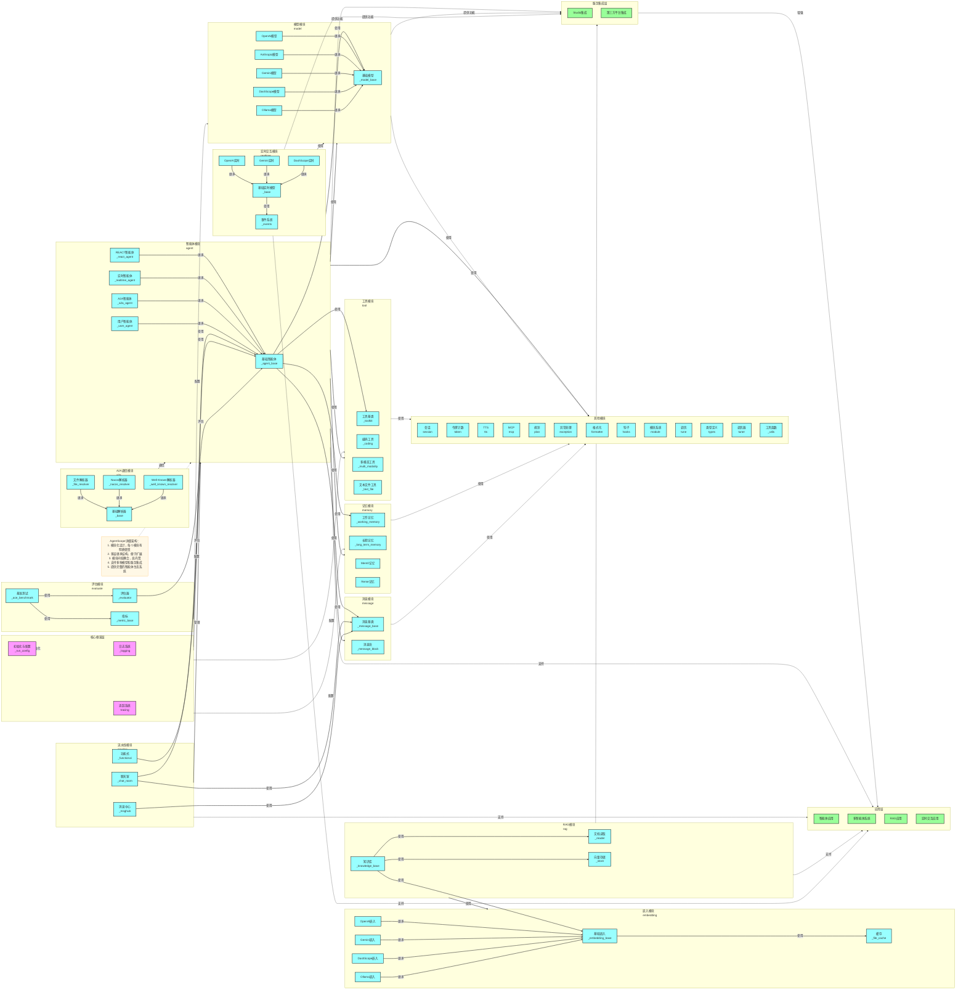

# AgentScope 项目架构图详细版

## 架构概述

AgentScope 是一个模块化的智能体框架，具有高度的可扩展性和灵活性。本详细版架构图展示了框架的模块结构和功能实现，重点关注模块间的关系和核心组件。

## 模块结构

### 1. 核心框架层

**职责**：提供框架的基础配置和运行环境

- **初始化与配置** (_run_config)：负责框架的初始化，设置运行参数和环境配置
- **日志系统** (_logging)：提供统一的日志记录功能，便于调试和监控
- **追踪系统** (tracing)：实现对智能体运行过程的追踪和监控

### 2. 智能体模块 (agent)

**职责**：实现智能体的核心功能和行为

- **基础智能体** (_agent_base)：智能体的基类，定义智能体的基本接口和行为
- **REACT智能体** (_react_agent)：实现REACT模式的智能体，支持推理和行动
- **实时智能体** (_realtime_agent)：支持实时交互的智能体
- **A2A智能体** (_a2a_agent)：支持智能体间通信的智能体
- **用户智能体** (_user_agent)：代表用户的智能体，处理用户输入

### 3. 模型模块 (model)

**职责**：封装各种AI模型的调用接口

- **基础模型** (_model_base)：模型的基类，定义模型的基本接口
- **OpenAI模型**：封装OpenAI模型的调用
- **Anthropic模型**：封装Anthropic模型的调用
- **Gemini模型**：封装Google Gemini模型的调用
- **DashScope模型**：封装阿里云DashScope模型的调用
- **Ollama模型**：封装Ollama本地模型的调用

### 4. 工具模块 (tool)

**职责**：为智能体提供各种实用工具

- **工具基类** (_toolkit)：工具的基类，定义工具的基本接口
- **编码工具** (_coding)：提供代码执行和编辑功能
- **多模态工具** (_multi_modality)：提供多模态处理能力
- **文本文件工具** (_text_file)：提供文本文件读写功能

### 5. 记忆模块 (memory)

**职责**：实现智能体的记忆功能

- **工作记忆** (_working_memory)：临时存储智能体的短期记忆
- **长期记忆** (_long_term_memory)：存储智能体的长期记忆
- **Mem0记忆**：集成Mem0记忆系统
- **Reme记忆**：集成Reme记忆系统

### 6. 消息模块 (message)

**职责**：定义智能体间通信的消息格式和处理机制

- **消息基类** (_message_base)：消息的基类，定义消息的基本结构
- **消息块** (_message_block)：消息的具体实现，支持不同类型的消息内容

### 7. RAG模块 (rag)

**职责**：实现检索增强生成功能

- **知识库** (_knowledge_base)：管理和组织知识
- **文档读取** (_reader)：支持多种文档格式的读取
- **向量存储** (_store)：实现向量检索功能

### 8. 嵌入模块 (embedding)

**职责**：提供文本和多模态嵌入功能

- **基础嵌入** (_embedding_base)：嵌入的基类，定义嵌入的基本接口
- **OpenAI嵌入**：使用OpenAI模型生成嵌入
- **Gemini嵌入**：使用Google Gemini模型生成嵌入
- **DashScope嵌入**：使用阿里云DashScope模型生成嵌入
- **Ollama嵌入**：使用Ollama本地模型生成嵌入
- **缓存** (_file_cache)：缓存嵌入结果，提高性能

### 9. 实时交互模块 (realtime)

**职责**：实现与模型的实时交互能力

- **基础实时模型** (_base)：实时模型的基类，定义实时交互的基本接口
- **OpenAI实时**：与OpenAI实时API的交互
- **Gemini实时**：与Google Gemini实时API的交互
- **DashScope实时**：与阿里云DashScope实时API的交互
- **事件系统** (_events)：处理实时交互中的事件

### 10. A2A通信模块 (a2a)

**职责**：实现智能体之间的通信机制

- **基础解析器** (_base)：服务发现的基类
- **文件解析器** (_file_resolver)：基于文件的服务发现
- **Nacos解析器** (_nacos_resolver)：基于Nacos的服务发现
- **Well-Known解析器** (_well_known_resolver)：基于Well-Known模式的服务发现

### 11. 流水线模块 (pipeline)

**职责**：管理多个智能体的协作流程

- **聊天室** (_chat_room)：实现多智能体的聊天场景
- **功能式** (_functional)：基于函数式编程的流水线
- **消息中心** (_msghub)：管理智能体间的消息传递

### 12. 评估模块 (evaluate)

**职责**：提供智能体性能评估框架

- **评估器** (_evaluator)：评估智能体性能的核心组件
- **基准测试** (_ace_benchmark)：提供标准的评估基准
- **指标** (_metric_base)：定义评估指标的基类

### 13. 其他模块

**职责**：提供框架的基础功能和支持

- **会话** (session)：管理智能体与用户的会话状态
- **令牌计数** (token)：统计和管理模型令牌使用
- **TTS** (tts)：文本到语音转换功能
- **MCP** (mcp)：模型调用协议，实现与外部服务的通信
- **规划** (plan)：支持智能体的任务规划能力
- **异常处理** (exception)：提供统一的异常处理机制
- **格式化** (formatter)：实现不同模型的输入输出格式化
- **钩子** (hooks)：提供框架的钩子机制，支持扩展功能
- **模块系统** (module)：实现模块化的组件管理
- **调优** (tune)：实现智能体参数调优功能
- **类型定义** (types)：提供统一的类型定义和验证
- **调优器** (tuner)：提供更高级的模型调优功能
- **工具函数** (_utils)：提供各种通用工具函数

### 14. 服务集成层

**职责**：集成外部服务和平台

- **Studio集成**：与AgentScope Studio的集成，提供可视化管理界面
- **第三方平台集成**：与其他第三方服务和平台的集成

### 15. 应用层

**职责**：基于框架构建的具体应用

- **智能体应用**：单个智能体的应用场景
- **多智能体系统**：多个智能体协作的应用场景
- **RAG应用**：基于检索增强生成的应用场景
- **实时交互应用**：需要实时交互的应用场景

## 模块依赖关系

### 智能体模块依赖
- **基础智能体**：依赖模型、工具、记忆、消息模块
- **REACT智能体**：继承自基础智能体，添加推理和行动能力
- **实时智能体**：继承自基础智能体，添加实时交互能力
- **A2A智能体**：继承自基础智能体，添加智能体间通信能力
- **用户智能体**：继承自基础智能体，处理用户输入

### 模型模块依赖
- **各种模型实现**：继承自基础模型，实现特定模型的调用

### RAG模块依赖
- **知识库**：依赖文档读取、向量存储和嵌入模块

### 嵌入模块依赖
- **各种嵌入实现**：继承自基础嵌入，使用不同模型生成嵌入
- **基础嵌入**：依赖缓存模块提高性能

### 实时交互模块依赖
- **各种实时模型**：继承自基础实时模型，实现与特定模型的实时交互
- **基础实时模型**：依赖事件系统处理实时事件

### A2A通信模块依赖
- **各种解析器**：继承自基础解析器，实现不同的服务发现机制

### 流水线模块依赖
- **聊天室**：依赖智能体和消息模块
- **功能式**：依赖智能体模块
- **消息中心**：依赖消息模块

### 评估模块依赖
- **评估器**：依赖智能体模块进行评估
- **基准测试**：依赖评估器和指标模块

### 模块间调用关系
- **智能体模块**：使用模型、工具、记忆、消息和其他模块
- **RAG模块**：使用嵌入模块
- **实时交互模块**：使用模型模块
- **A2A通信模块**：与智能体模块通信
- **流水线模块**：管理智能体模块
- **评估模块**：评估智能体模块
- **模型、工具、记忆、消息模块**：使用其他模块提供的基础功能

## 服务与应用

- **核心模块**：为服务集成层提供功能支持
- **服务集成层**：增强应用层的能力
- **应用层**：基于核心模块和服务集成层构建具体应用

## 核心特性

1. **模块化设计**：每个模块有明确职责，便于维护和扩展
2. **多层继承结构**：通过继承机制实现功能扩展，代码复用率高
3. **模块间低耦合**：模块间通过明确的接口通信，降低依赖
4. **高内聚**：每个模块内部功能紧密相关，职责单一
5. **多模型支持**：支持多种AI模型，包括OpenAI、Anthropic、Gemini等
6. **多服务集成**：支持与多种外部服务和平台集成
7. **完整的智能体生态系统**：提供从基础组件到高级功能的完整解决方案

