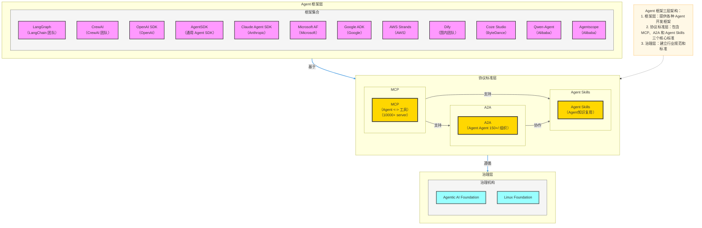

```mermaid
flowchart TB
    %% 样式定义（沿用参考风格，保持视觉一致性）
    classDef frameworkStyle fill:#f9f,stroke:#333,stroke-width:2px
    classDef protocolStyle fill:#ffd700,stroke:#333,stroke-width:3px
    classDef governanceStyle fill:#9ff,stroke:#333,stroke-width:2px
    classDef subgraphStyle fill:#f5f5f5,stroke:#666,stroke-width:1px,rounded:10px
    classDef layerStyle fill:#e8f4f8,stroke:#4299e1,stroke-width:1.5px,rounded:10px
    classDef ruleNoteStyle fill:#fff8e6,stroke:#ffb74d,stroke-width:1px,rounded:8px

    %% 1. Agent 框架层
    subgraph agentLayer["Agent 框架层"]
        subgraph frameworks["框架集合"]
            A[LangGraph<br/>（LangChain 团队）]:::frameworkStyle
            B[CrewAI<br/>（CrewAI 团队）]:::frameworkStyle
            C[OpenAI SDK<br/>（OpenAI）]:::frameworkStyle
            D[AgentSDK<br/>（通用 Agent SDK）]:::frameworkStyle
            E[Claude Agent SDK<br/>（Anthropic）]:::frameworkStyle
            F[Microsoft AF<br/>（Microsoft）]:::frameworkStyle
            G[Google ADK<br/>（Google）]:::frameworkStyle
            H[AWS Strands<br/>（AWS）]:::frameworkStyle
            I[Dify<br/>（国内团队）]:::frameworkStyle
            J[Coze Studio<br/>（ByteDance）]:::frameworkStyle
            K[Qwen-Agent<br/>（Alibaba）]:::frameworkStyle
            L[Agentscope<br/>（Alibaba）]:::frameworkStyle
        end
    end
    class agentLayer layerStyle
    class frameworks subgraphStyle

    %% 2. 协议标准层
    subgraph protocolLayer["协议标准层"]
        %% MCP 部分
        subgraph mcpSection["MCP"]
            M1[MCP<br/>（Agent <-> 工具）<br/>（10000+ server）]:::protocolStyle
        end
        class mcpSection subgraphStyle

        %% A2A 部分
        subgraph a2aSection["A2A"]
            A1[A2A<br/>（Agent Agent 150+/ 组织）]:::protocolStyle
        end
        class a2aSection subgraphStyle

        %% Agent Skills 部分
        subgraph skillsSection["Agent Skills"]
            S1[Agent Skills<br/>（Agent知识复用）]:::protocolStyle
        end
        class skillsSection subgraphStyle
    end
    class protocolLayer layerStyle

    %% 3. 治理层
    subgraph governanceLayer["治理层"]
        subgraph governance["治理机构"]
            R[Agentic AI Foundation]:::governanceStyle
            S[Linux Foundation]:::governanceStyle
        end
    end
    class governanceLayer layerStyle
    class governance subgraphStyle

    %% 层级关系
    agentLayer -->|基于| protocolLayer
    protocolLayer -->|遵循| governanceLayer

    %% 协议标准层内部关系
    mcpSection -->|支持| a2aSection
    mcpSection -->|支持| skillsSection
    a2aSection -->|协作| skillsSection

    %% 连接线样式
    linkStyle 0,1 stroke:#4299e1,stroke-width:2px,arrowheadStyle:filled
    linkStyle 2,3,4 stroke:#666,stroke-width:1.5px,arrowheadStyle:filled

    %% 架构说明
    Note[Agent 框架三层架构：<br/>1. 框架层：提供各种 Agent 开发框架<br/>2. 协议标准层：包含 MCP、A2A 和 Agent Skills 三个核心标准<br/>3. 治理层：建立行业规范和标准]:::ruleNoteStyle
    Note -.-> protocolLayer
```