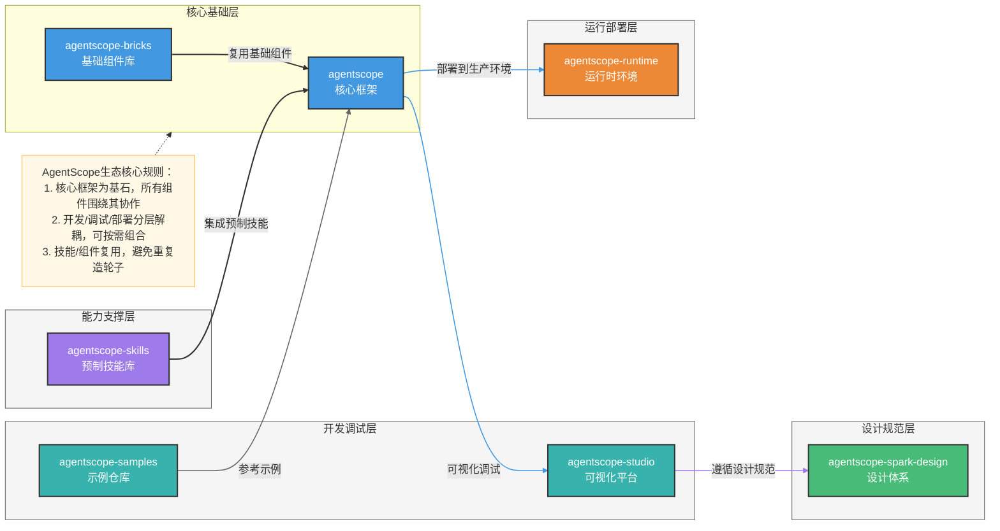

### AgentScope 生态体系全解析
你希望我系统介绍 AgentScope 开源生态的核心构成（7 个核心仓库）、各组件定位，以及实际场景下的搭配使用方式，并参考指定风格制作 Mermaid 架构图辅助理解，以下是完整内容。

---

## 一、AgentScope 生态核心定位
AgentScope 是面向**多智能体（Multi-Agent）应用开发**的一站式开源生态体系，核心目标是降低多智能体系统的开发、调试、部署、运维门槛，覆盖从「基础开发」到「生产落地」的全生命周期，生态内各组件各司其职且无缝协作。

## 二、生态核心仓库及功能定位
| 仓库地址 | 组件名称 | 核心定位 & 核心功能 |
|----------|----------|---------------------|
| [agentscope](https://github.com/agentscope-ai/agentscope) | 核心框架 | 生态基石，提供多智能体开发的核心能力： ✅ 智能体（Agent）定义与管理 ✅ 多智能体消息通信/协作机制 ✅ 大模型（LLM）适配与调用 ✅ 环境（Environment）管理 |
| [agentscope-studio](https://github.com/agentscope-ai/agentscope-studio) | 可视化开发/调试平台 | 低代码工具，降低使用门槛： ✅ 图形化配置智能体、定义协作逻辑 ✅ 实时调试多智能体交互过程 ✅ 可视化监控消息流转/日志 |
| [agentscope-samples](https://github.com/agentscope-ai/agentscope-samples) | 示例仓库 | 新手入门 & 场景参考： ✅ 覆盖客服、代码助手、多智能体协作任务等典型案例 ✅ 可直接运行，快速理解多智能体开发模式 ✅ 基于示例可快速二次开发 |
| [agentscope-spark-design](https://github.com/agentscope-ai/agentscope-spark-design) | 设计体系 | 生态视觉/交互规范： ✅ 统一的 UI 组件库、视觉风格 ✅ 适配 Studio 等生态产品的定制化设计 ✅ 保障生态内产品交互一致性 |
| [agentscope-runtime](https://github.com/agentscope-ai/agentscope-runtime) | 运行时环境 | 生产级部署运维： ✅ 多智能体应用的部署、调度、资源管理 ✅ 支持单机/分布式运行 ✅ 应用生命周期监控与故障恢复 |
| [agentscope-skills](https://github.com/agentscope-ai/agentscope-skills) | 技能库 | 可复用智能体能力： ✅ 预制技能（文本总结、代码生成、工具调用等） ✅ 技能注册/调用标准化 ✅ 无需重复开发通用能力 |
| [agentscope-bricks](https://github.com/agentscope-ai/agentscope-bricks) | 基础组件库 | 通用工具模块： ✅ 消息解析、模型适配器、配置管理器 ✅ 日志/监控工具 ✅ 跨组件复用的基础模块 |

## 三、生态组件搭配使用场景
### 场景 1：新手快速入门（0 基础上手）
1. 克隆 `agentscope-samples`，运行示例（如简单对话智能体、多智能体协作任务），理解核心逻辑；
2. 基于 `agentscope` 核心库，参考 samples 改写出自己的第一个多智能体应用；
3. 用 `agentscope-studio` 可视化调试应用（无需手动改代码查错，直观看到消息流转）。

### 场景 2：企业级多智能体应用开发（生产落地）

### 场景 3：定制化 UI 开发
基于 `agentscope-spark-design` 的设计规范，定制 `agentscope-studio` 的界面，或开发专属的多智能体应用前端，保证与生态产品的视觉/交互一致性。

## 四、总结
### 关键点回顾
1. **核心基石**：`agentscope` 是整个生态的核心，`bricks` 提供基础组件复用，二者构成多智能体开发的底层能力；
2. **效率提升**：`studio`（可视化调试）+ `samples`（示例参考）+ `skills`（预制技能）大幅降低开发成本；
3. **生产落地**：`runtime` 负责应用部署运维，`spark-design` 保障定制化开发的体验一致性，覆盖从开发到落地的全流程。

AgentScope 生态的设计核心是「分层解耦、复用提效」，无论新手入门还是企业级落地，都能找到适配的组件组合方式。